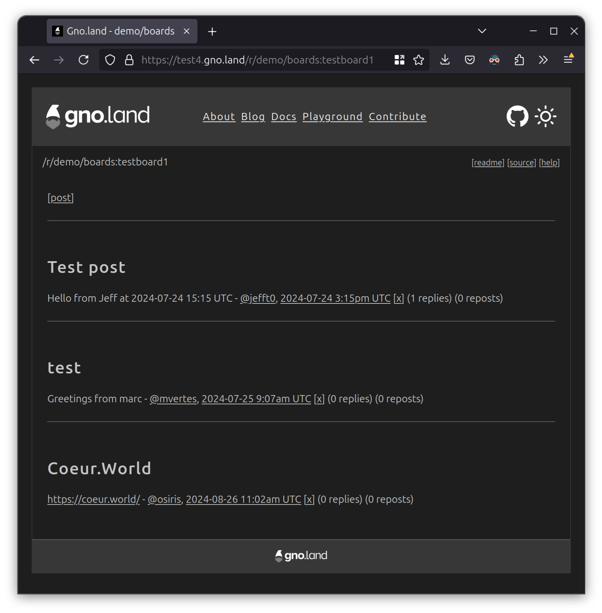
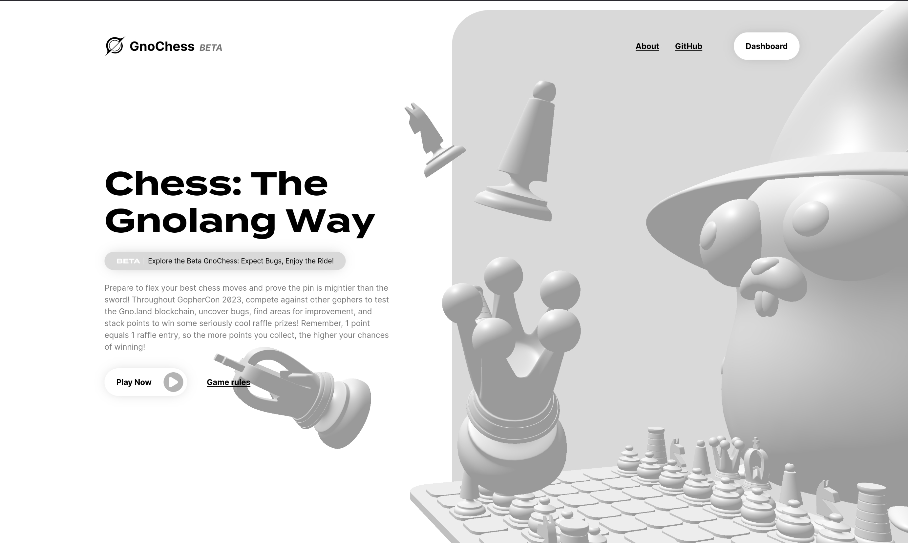
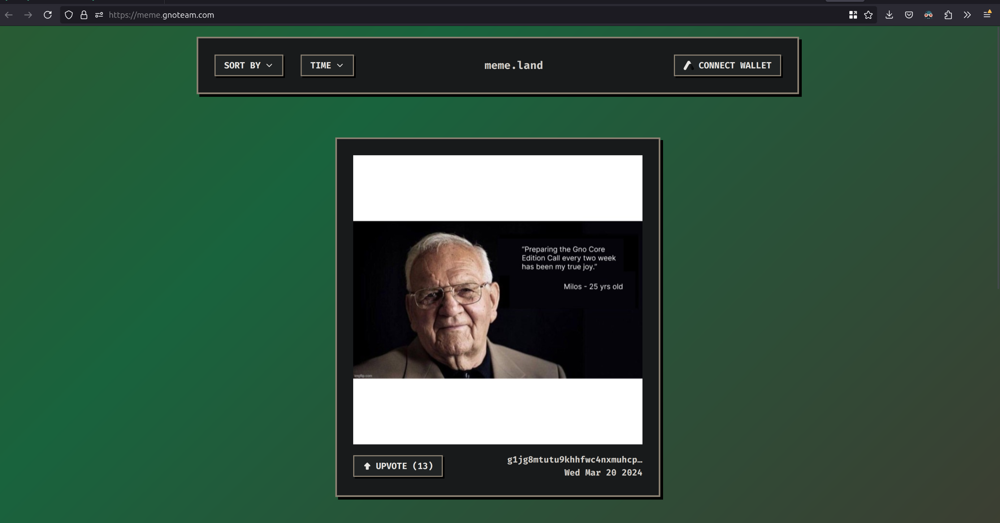
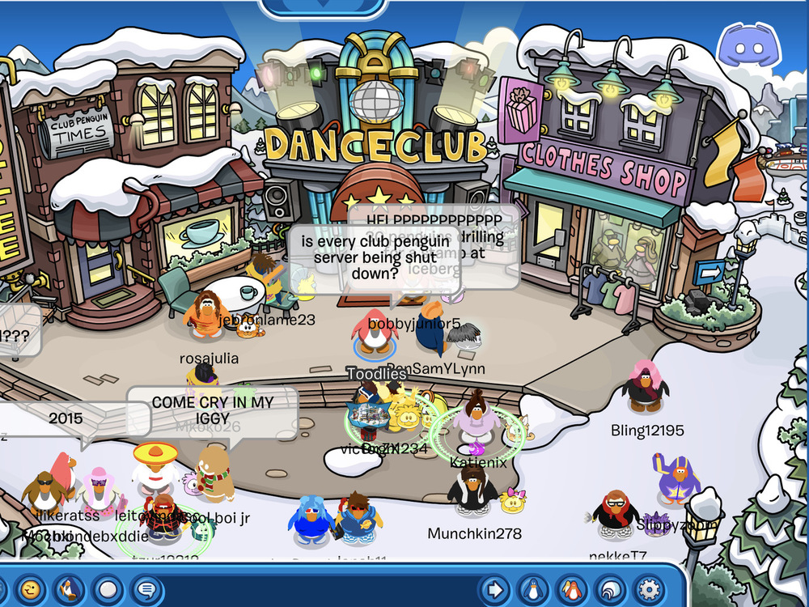
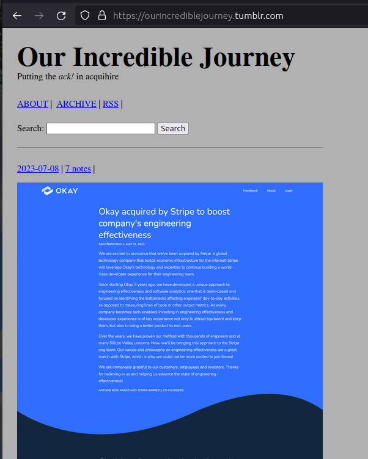

# Distributed Communities

## how to build timeless and decentralized apps, with Go

Go Turin Meetup, Sept 23, 2024

Morgan Bazalgette \
Core Team Developer @ gno.land

---

# `$ whoami`

- Morgan Bazalgette
  - Not Baguette
- In spite of the surname, not French
- Pretty much always worked in open source
- And for a slightly smaller period, always worked in Go
- Learning Zig to spite Rust programmers <!-- .element: class="fragment" -->
- Playing the ukulele to spite my neighbours <!-- .element: class="fragment" -->
- Being silly in a company presentation to spite marketing <!-- .element: class="fragment" -->

<!-- TODO: add serious picture, overlap with silly picture at the end -->


---

# What we'll see today

<span>1. Intro to Gno</span>

  - Intro to packages and realms
  - Examples of programs developed in Gno.land
  - Intro to some programs

<span>2. Live demo</span>

  - Primer into gno repl and gno debugger
  - We'll live-build a small, simple social network
  - We'll discover a few tools of the trade, like gnodev and gnobro

---

# What is Gno?


A programming language for building decentralized and distributed applications.

- Interpreted and deterministic.
- Powers gno.land, a blockchain programmed by Gno code.
  - It's not launched yet. (But it's cool, I swear.)
- Global variables as its persistent data store.
- Go 1.17 subset - no generics, concurrency (yet...)

---

# Packages and Realms

<!-- Screen is split in 2 sides -->

<div style="display:flex">
<div style="width: 50%">

### Packages

- Re-usable pieces of code, like Go
- Will use our Go-inspired `gno.mod` for versioning
- Cannot import realms
- Includes standard library, mimicking Go's (still WIP)

```go
// Package ufmt provides utility functions for
// formatting strings [...]
package ufmt

import "strconv"

// Sprintf offers similar functionality to Go's fmt.Sprintf
// or the sprintf equivalent available in many languages,
// [...]
func Sprintf(format string, args ...interface{}) string {
	end := len(format)
	argNum := 0
	argLen := len(args)
	buf := ""

	for i := 0; i &lt; end; {
		isLast := i == end-1
		c := format[i]

		if isLast || c != '%' {
			buf += string(c)
			i++
			continue
		}
		// ...
```

</div>
<div style="width:50%">

### Realms

- End-user "Smart Contracts"
- Exported functions can be directly called on a Node through RPC
- Persist state through global variables
- Can import other realms for Contract-to-Contract interactions

```go
package counter

import "strconv"

var counter int

func Increment() int {
	counter++
	return counter
}

func Render(string) string {
	return strconv.Itoa(counter)
}
```

</div>
</div>

---

<video src="https://drop.howl.moe/f43be6477c-2024-09-23_14-50-03.speed.mp4" controls preload=auto style="width: 60%"></video>

---

# A few examples

 <!-- .element: style="width:50%" -->

---

### `gno.land/r/demo/boards`

```go
func CreateThread(bid BoardID, title string, body string) PostID {
	if !(std.IsOriginCall() || std.PrevRealm().IsUser()) {
		panic("invalid non-user call")
	}
	caller := std.GetOrigCaller()
	if usernameOf(caller) == "" {
		if !checkAnonFee() {
			panic("please register, otherwise minimum fee [...]")
		}
	}
	board := getBoard(bid)
	if board == nil {
		panic("board not exist")
	}
	thread := board.AddThread(caller, title, body)
	return thread.id
}
```
<!-- .element: style="height: 80vh" -->


---

# A few examples

 <!-- .element: style="Height: 80vh" -->

---

### `github.com/gnolang/gnochess`

```go
// MakeMove specifies a move to be done on the given game, specifying in
// algebraic notation the square where to move the piece. [...]
func MakeMove(gameID, from, to string, promote chess.Piece) string {
	assertOriginCall()

	g := getGame(gameID, true)

	// determine if this is a black move
	isBlack := len(g.Position.Moves)%2 == 1

	caller := std.GetOrigCaller()
	if (isBlack && g.Black != caller) ||
		(!isBlack && g.White != caller) {
		// either not a player involved; or not the caller's turn.
		panic("you are not allowed to make a move at this time")
	}
	// ...
```
<!-- .element: style="height: 80vh" -->


---

### `github.com/gnolang/gnochess`

```go
// avl (Adelson-Velsky-Landis) tree is a kind of binary tree
var gameStore avl.Tree // string (game ID) -> *Game

func getGame(id string, wantOpen bool) *Game {
	graw, ok := gameStore.Get(id)
	if !ok {
		panic("game not found")
	}
	g := graw.(*Game)
	if wantOpen && g.State.IsFinished() {
		panic("game is already finished")
	}
	return g
}
```
<!-- .element: style="height: 80vh" -->

---

# A few examples



---

### `gno.land/r/demo/memeland`

```go
type Memeland struct {
	*ownable.Ownable
	Posts       []*Post
	MemeCounter seqid.ID
}

// PostMeme - Adds a new post
func (m *Memeland) PostMeme(data string, timestamp int64) string {
	if data == "" || timestamp <= 0 {
		panic("timestamp or data cannot be empty")
	}

	// Generate ID
	id := m.MemeCounter.Next().String()

	newPost := &Post{
		ID:            id,
		Data:          data,
		Author:        std.PrevRealm().Addr(),
		Timestamp:     time.Unix(timestamp, 0),
		UpvoteTracker: avl.NewTree(),
	}

	m.Posts = append(m.Posts, newPost)
	return id
}
```
<!-- .element: style="height: 80vh" -->

---

### And now, for some frontend

```ts
const fetchPosts = async (
  page: number,
  sort: EPostSort = EPostSort.UPVOTES
): Promise<IPost[]> => {
  if (!provider) {
    throw new Error('invalid chain RPC URL');
  }

  const startTimestamp: number = constructStartTimestamp(time);
  const endTimestamp: number = Math.floor(new Date().getTime() / 1000);

  const response: string = await provider.evaluateExpression(
    Config.REALM_PATH,
    `GetPostsInRange(${startTimestamp},${endTimestamp},${page},${postsPerFetch},"${sort}")`
  );

  // Parse the posts response
  return parsePostFetchResponse(response);
};
```
<!-- .element: style="height: 80vh" -->

---

# gno (automatic grpc) +
# gno.land (distributed aws)

- Using **Gno realms**, you can write simple programs whose exported functions
  become automatically "API" functions
  - They can be called by either being imported by another realm (smart contract),
    or they can be called directly by the end user
- **gno.land is a blockchain** built on top of Gno
  - Still not fully launched (but we're close, come discover and play around --> <https://gno.land>)
  - It allows to build the applications like those shown in a decentralized/distributed manner.
  - Each "node" on the blockchain can perform transactions and be used
  - Builder oriented; we're more interested in "general-purpose" dApps rather than just finance.

---

# Timeless?

- This is an intention, rather than a promise
- But apps on gno.land will last as long as the blockchain does, rather than their creators
- Every realm is 100% open source
- The chain is always forkable; and even should it shut down, the chain and all of its data can be continued by someone else.
- => open, hackable and inspectable backend apps with open data.

---

## Demo time!

---

## Why do we need Web3 dApps?



---

## Why do we need Web3 dApps?

> https://ourincrediblejourney.tumblr.com/



---

## Why do we need Web3 dApps?

> https://bitcoin.org/bitcoin.pdf

> Commerce on the Internet has come to rely almost exclusively on financial institutions serving as trusted third parties to process electronic payments. [...] Completely non-reversible transactions are not really possible, since financial institutions cannot avoid mediating disputes. The cost of mediation increases transaction costs, [...] and there is a broader cost in the loss of ability to make non-reversible payments for non-reversible services. With the possibility of reversal, the need for trust spreads. Merchants must be wary of their customers, hassling them for more information than they would otherwise need.
>
> [...] These costs and payment uncertainties can be avoided in person by using physical currency, but no mechanism exists to make payments over a communications channel without a trusted party.

What Web3 enables is what Web2 never could: \
**Achieve trust in a trustless environment.**

---

# Q&A

---

# Thanks!

Come find out about gno:

- https://gno.land
- https://github.com/gnolang
- The core team's here. Let's have a chat!

And now, time for an aperitivo!
