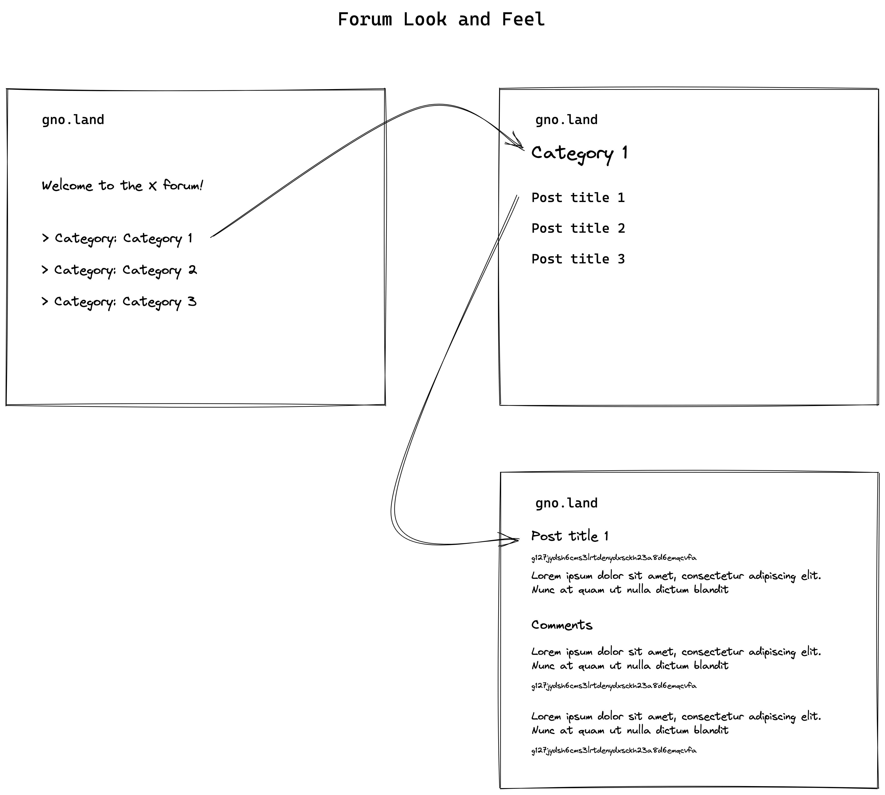
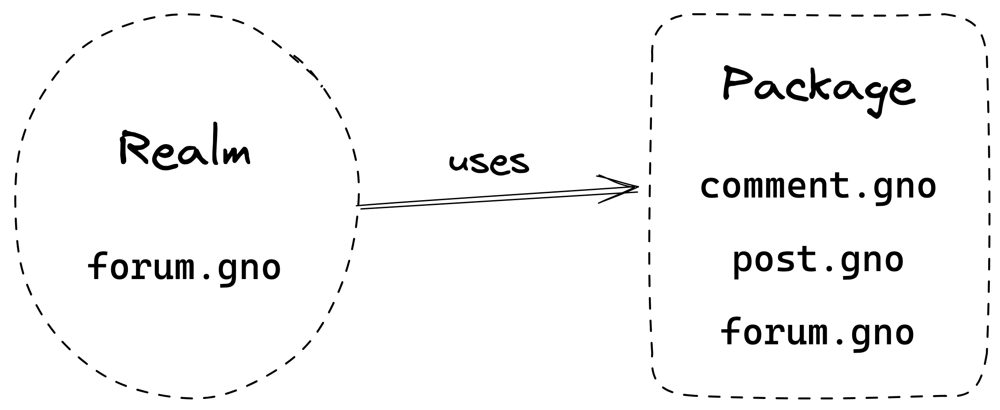
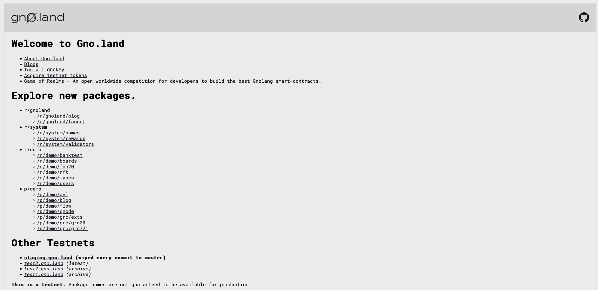
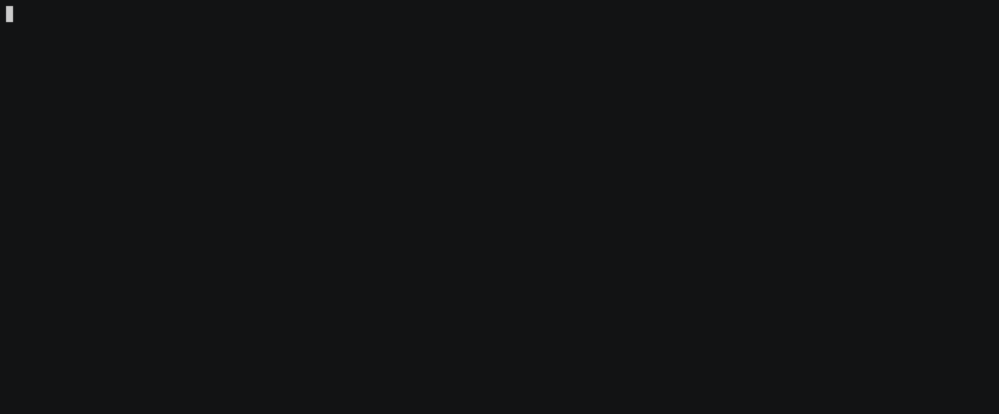
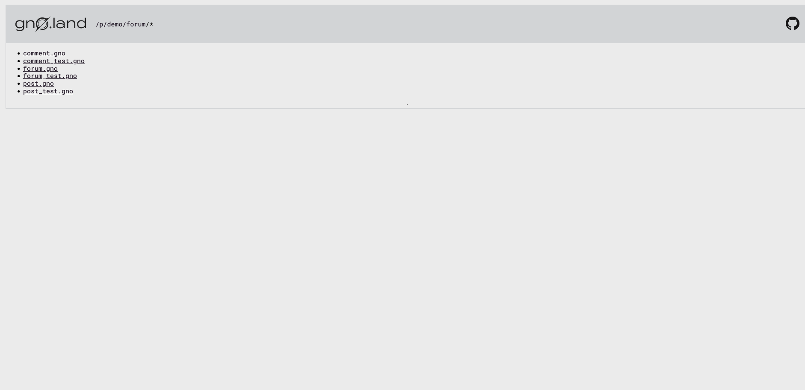
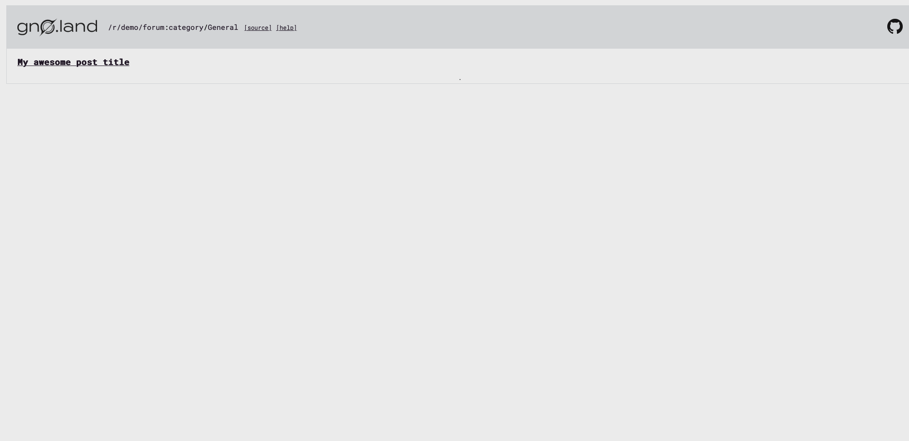
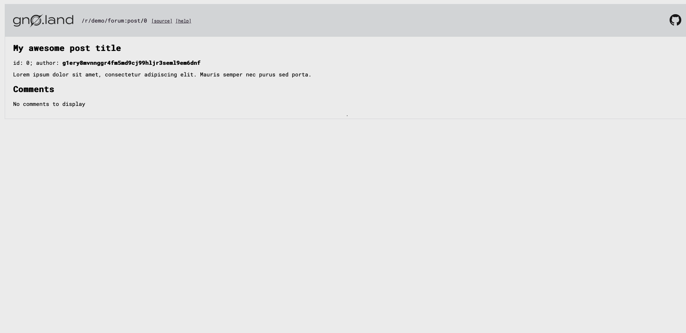
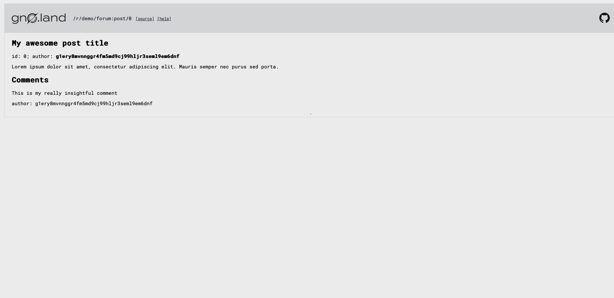

# Gnolang workshop: How to build a forum in Gno.land

The recording of this workshop is available [here](https://www.youtube.com/watch?v=gmP-mH-64HA).

## Intro

gno.land is a blockchain layer 1 solution focused on making Smart Contract development as easy, and as straightforward as possible. This means catering to the preferences of users, their habits in developing code, and giving them the tools they need to get up and running with their apps quicker.

In this tutorial, we are going to go over the tools available for developing performant Smart Contracts in Gnolang, we will discuss what Realms and Packages are and how they differ. To illustrate these points, we will be creating a simple forum where users can:

- Define top-level categories for the forum
- Create posts
- Comment on posts
- Appoint moderators for managing posts (deleting them)

This may seem like a lot at first, but once we discuss the concepts of Realms and Packages, and how Gnolang can be tested, it will be much clearer.

We will be writing out the forum example using Gnolang (Gno), which is an interpreted version of Go, that runs on the Gno VM. To learn more about the Gno VM and Gno, have a look at [this blog post](https://test3.gno.land/r/gnoland/blog:p/intro).

## Packages

A gno.land Package is simply a bundle of functionality. Most importantly, it does not contain any kind of state, so in this sense it is viewed as a library. Additionally, packages can be imported from other Packages and Realms, using the `import "gno.land/p/..."` syntax.

## Realms

A Realm is a Smart Contract on gno.land, written in Gno. In contrast to Packages, Realms *do* contain state (can hold values), they are imported using the `import "gno.land/r/..."` syntax.

Additionally, Realms can optionally expose a `Render` method for Markdown, that can display internal Realm state to the user using an intuitive UI. We will get more into `Render` methods in a second, and how we can write them correctly.

## What we’re building

As mentioned before, we will be building a small forum that users can interact with using their blockchain nodes on gno.land.

Essentially, the preliminary look and feel of the forum homepage will look something like this:



Posts are sorted into categories, and opening a category lists all the posts tied to it. Opening a post opens the post and its accompanying comment section.

We mentioned earlier that we would like to split up our code into Realms and Packages. Packages are treated like libraries, in a sense that they do not contain state, whereas Realms do.

Having this in mind, it is easy to split up the functionality between Realms and Packages.



The Package we’re building `gno.land/p/demo/forum` will be a generic forum scaffolding that any custom forum instance can utilize. These include things like a `Post`, `Comment` and `Forum`.

The Realm, called `gno.land/r/demo/forum` will simply utilize the forum Package we build out, and add some custom logic to it for the user.

## Where do we put these `.gno` files?

Currently, on the main repo, packages and realms sit under the `examples/gno.land` folder structure.

We will be creating a single `.gno` file for the forum Realm, and 3 `.gno` files for the Package:

```
gno/
├─ examples/
│  ├─ gno.land/
│  │  ├─ r/
│  │  │  ├─ demo/
│  │  │  │  ├─ forum/
│  │  │  │  │  ├─ forum.gno
│  │  ├─ p/
│  │  │  ├─ demo/
│  │  │  │  ├─ forum/
│  │  │  │  │  ├─ forum.gno
│  │  │  │  │  ├─ post.gno
│  │  │  │  │  ├─ comment.gno
├─ .../
```

## Building the `forum` package

### Setting up the repo

To get started, we need to clone the repository locally:

```bash
git clone https://github.com/gnolang/gno
```

This will create a new folder in our directory called `gno`. Once we open it up in our terminal window, we can run the `build` command to make sure the necessary tooling is present:

```bash
cd gno
make build
```

The `Makefile` build directive will build out tools like `gnodev` and `gnokey`, that come bundled with gno, and that we need for developing and testing our Gnolang Smart Contracts.

You will find these tools in the `build` folder. Additionally, if we’d like to have these tools installed globally, we can run the following commands:

```bash
make install_gnokey
make install_gnodev
```

Now these binaries are runnable from outside the `gno` repo. We will get into the functionalities of these tools in just a second.

### `post.gno`

We can create a new file in the `examples/gno.land/p/forum` directory named `post.gno`. This file is going to contain the basic definition for a single forum post, and have some helper methods that are useful.

We start writing this file by defining the package at the top:

```go
// examples/gno.land/p/forum/post.gno

package forum
```

Like regular Go, Gno adheres to the same syntax and nuances. We define the single post type:

```go
// Post represents a single forum post
type Post struct {
    id uint

    title    string
    body     string
    category string

    comments []*Comment
    author   std.Address
}
```

There are a couple of things happening here. A post has an ID that is assigned to it, a title, body, and category. Additionally, it also contains author information and a list of comments. We will define the `Comment` type in a second.

Notice the type for the `author` field – it’s `std.Address`.

Gnolang has an import system that differs from regular Go. The `std` package is a `builtin` Gnolang package that is accessible in any Gnolang file, and is resolved when compiling / running the file.

Additionally, to use the `Address` type from the `std` package, we need to import it using `import "std"`. By now, our `post.gno` file should look like this:

```go
package forum

import "std"

// Post represents a single forum post
type Post struct {
    id uint

    title    string
    body     string
    category string

    comments []*Comment
    author   std.Address
}
```

Remember, Packages do not hold state, so it is impossible to have a `Post` initialized here. We need to add a constructor method for any Realm that might want to create a new `Post` instance:

```go
// NewPost creates a new forum post
func NewPost(
    id uint,
    title string,
    body string,
    author std.Address,
) *Post {
    return &Post{
        id:       id,
        title:    title,
        body:     body,
        author:   author,
        comments: make([]*Comment, 0),
    }
}
```

Additionally, we can also define several getters and setters for manipulating post data:

```go
// GetID returns the post's ID
func (p *Post) GetID() uint {
    return p.id
}

// GetTitle returns the post's title
func (p *Post) GetTitle() string {
    return p.title
}

// GetBody returns the post's body
func (p *Post) GetBody() string {
    return p.body
}

// GetAuthor returns the post's author (address)
func (p *Post) GetAuthor() std.Address {
    return p.author
}

// GetCategory returns the post's category
func (p *Post) GetCategory() string {
    return p.category
}

// SetCategory sets the post's category
func (p *Post) SetCategory(category string) {
    p.category = category
}

// AddComment adds a new comment to a post
func (p *Post) AddComment(comment *Comment) {
    p.comments = append(p.comments, comment)
}

// GetComments returns the comments on a post
func (p *Post) GetComments() []*Comment {
    return p.comments
}
```

By now, our `post.gno` file should look like this:

```go
package forum

import "std"

// Post represents a single forum post
type Post struct {
    id uint

    title    string
    body     string
    category string

    comments []*Comment
    author   std.Address
}

// NewPost creates a new forum post
func NewPost(
    id uint,
    title string,
    body string,
    author std.Address,
) *Post {
    return &Post{
        id:       id,
        title:    title,
        body:     body,
        author:   author,
        comments: make([]*Comment, 0),
    }
}

// GetID returns the post's ID
func (p *Post) GetID() uint {
    return p.id
}

// GetTitle returns the post's title
func (p *Post) GetTitle() string {
    return p.title
}

// GetBody returns the post's body
func (p *Post) GetBody() string {
    return p.body
}

// GetAuthor returns the post's author (address)
func (p *Post) GetAuthor() std.Address {
    return p.author
}

// GetCategory returns the post's category
func (p *Post) GetCategory() string {
    return p.category
}

// SetCategory sets the post's category
func (p *Post) SetCategory(category string) {
    p.category = category
}

// AddComment adds a new comment to a post
func (p *Post) AddComment(comment *Comment) {
    p.comments = append(p.comments, comment)
}

// GetComments returns the comments on a post
func (p *Post) GetComments() []*Comment {
    return p.comments
}
```

### `comment.gno`

Before we even discuss testing this out, we must define the `Comment` type, inside `comment.gno`:

```go
package forum

import "std"

type Comment struct {
    body string

    author std.Address
}

// NewComment creates a new comment
func NewComment(body string) *Comment {
    return &Comment{
        body:   body,
        author: std.GetOrigCaller(),
    }
}

// GetBody returns the comment body
func (c *Comment) GetBody() string {
    return c.body
}

// GetAuthor returns the comment author
func (c *Comment) GetAuthor() std.Address {
    return c.author
}
```

A comment contains a simple body, and is linked to an author. There is one interesting thing here, and that is how we resolve who the author is, by using `std.GetOrigCaller()`.

`std.GetOrigCaller()` is a helper method that returns the bach39 address of the caller (transaction initiator).

### Running tests

We can define several test files, one for the `Post`, and one for the `Comment`. These test files are like any regular Go test files, the only difference being they end with `_test.gno`:

```go
// examples/gno.land/p/demo/forum/comment_test.gno
package forum

import (
    "std"
    "testing"

    "gno.land/p/demo/testutils"
)

// TestComment_New verifies that a
// new forum post comment can be created successfully
func TestComment_New(t *testing.T) {
    const (
        body   string      = "Lorem ipsum dolor sit amet, consectetur adipiscing elit."
        author std.Address = testutils.TestAddress("author")
    )

    // Create a new post
    std.TestSetOrigCaller(author)
    p := NewComment(body)

    // Check that the data matches
    if p.GetBody() != body {
        t.Fatalf("invalid body")
    }

    if p.GetAuthor().String() != author.String() {
        t.Fatalf("invalid author")
    }
}
```

The comment test simply verifies a new `Comment` can be successfully created. If you remember, in our `Comment` constructor, we utilized `std.GetOrigCaller()`.

To mock this data in the test, we can use `std.TestSetOrigCaller`, to set the return value for the transaction initiator.

Likewise, we can write out a test for creating a `Post`:

```go
// examples/gno.land/p/forum/post_test.gno
package forum

import (
    "std"
    "testing"

    "gno.land/p/demo/testutils"
)

// TestPost_New verifies that a
// new forum post can be created successfully
func TestPost_New(t *testing.T) {
    var (
        id       uint        = 123
        title                = "Example Post Title"
        body                 = "Lorem ipsum dolor sit amet, consectetur adipiscing elit."
        category             = "category 1"
        author   std.Address = testutils.TestAddress("author")
    )

    // Create a new post
    p := NewPost(id, title, body, author)
    p.SetCategory(category)

    // Check that the data matches
    if p.GetID() != id {
        t.Fatalf("invalid ID")
    }

    if p.GetTitle() != title {
        t.Fatalf("invalid title")
    }

    if p.GetBody() != body {
        t.Fatalf("invalid body")
    }

    if p.GetCategory() != category {
        t.Fatalf("invalid category")
    }

    if p.GetAuthor().String() != author.String() {
        t.Fatalf("invalid author")
    }
}
```

How do we test these files? We can’t simply run `go test ./...` and expect these to run, even though they look identical to standard Go tests.

This is where the tools we’ve installed beforehand can be helpful, namely `gnodev`.

The `gnodev` tool has many interesting options, but the one we need is for running tests. We can run the tests in the package using:

```bash
gnodev test --verbose examples/gno.land/p/demo/forum
```

We point `gnodev` to the package we would like to test (folder that contains `_test.gno` files), and enable the `-verbose` flag to get some feedback on which tests are being run.

```bash
gnodev test --verbose examples/gno.land/p/demo/forum

=== RUN   TestComment_New
--- PASS: TestComment_New (0.00s)
=== RUN   TestPost_New
--- PASS: TestPost_New (0.00s)
ok      ./examples/gno.land/p/demo/forum        0.67s
```

### `forum.gno`

Finally, we can work on our `Forum` instance. Remember, this `Forum` logic should be as generic as possible, as we’re building a Package some Realms can adapt to their needs.

When introducing this tutorial, we mentioned that the forum we’re building has categories, and that posts are assigned to a specific category. Additionally, we also mentioned that there is a forum admin that can appoint moderators to moderate posts.

With this in mind, we can define the base `Forum` type:

```go
// examples/gno.land/p/forum/forum.gno
package forum

import (
    "std"

    "gno.land/p/demo/avl"
)

// Forum represents a single forum instance
type Forum struct {
    name string

    posts      avl.Tree // post id -> post
    categories avl.Tree // category name -> []post (for lookups)

    admin      std.Address
    moderators avl.Tree // category name -> []address
}
```

There are a couple of things that need to be discussed here, namely the use of `avl.Tree`. If we think about it, there are essentially 2 ways we can keep track of posts based on their category:

1. we can have an array for each category, and append posts there
2. we can use a map, and map the category name to an array of posts

The `avl.Tree` instance is just that – it is a simple map that allows us to perform quick lookups and storage of data. Seeing as `avl.Tree` is a package itself, we can import it using the `"gno.land/p/demo/avl"` syntax.

We utilize a map to:

- map the post ID to its instance
- map the category name to a list of posts belonging to that category
- map the category name to a list of moderators for that specific category

We need to define a constructor for the `Forum` instance:

```go
// NewForum creates a new forum instance
func NewForum(
    name string,
    categories []string,
    admin std.Address,
) *Forum {
    // Create a new forum instance
    f := &Forum{
        name:       name,
        categories: avl.Tree{},
        posts:      avl.Tree{},
        admin:      admin,
        moderators: avl.Tree{},
    }

    // Instantiate the categories
    for _, category := range categories {
        f.categories.Set(category, make([]*Post, 0))

        // Instantiate the initial moderator set
        f.moderators.Set(category, []std.Address{admin})
    }

    return f
}
```

During this `Forum` instance creation, we assume that the forum admin is a moderator for each of the categories. We also initialize each category with an empty list of posts.

Further on, we define the getter logic for the `Forum` type:

```go
// GetName returns the forum name
func (f Forum) GetName() string {
    return f.name
}

// GetCategories fetches the forum categories
func (f Forum) GetCategories() []string {
    var (
        categories = make([]string, f.categories.Size())
        index      = 0
    )

    f.categories.Iterate("", "", func(category *avl.Node) bool {
        // Add the category to the list
        categories[index] = category.Key()

        index++

        // Continue iteration
        return false
    })

    return categories
}

// GetComments fetches the comments for a specific post
func (f Forum) GetComments(postID uint) []*Comment {
    postRaw, found := f.posts.Get(ufmt.Sprintf("%d", postID))
    if !found {
        // Post does not exist
        return nil
    }

    post, _ := postRaw.(*Post)

    return post.GetComments()
}

// GetCategoryPosts fetches the posts associated with a specific category
func (f Forum) GetCategoryPosts(category string) []*Post {
    categoryPostsRaw, found := f.categories.Get(category)
    if !found {
        // No posts found for this category
        return nil
    }

    return categoryPostsRaw.([]*Post)
}

// GetPosts returns all posts on the forum
func (f Forum) GetPosts() []*Post {
    posts := make([]*Post, f.posts.Size())

    index := 0
    f.posts.Iterate("", "", func(n *avl.Node) bool {
        posts[index] = n.Value().(*Post)

        return false
    })

    return posts
}

// GetPost returns a post using the ID, if any
func (f Forum) GetPost(postID string) *Post {
    post, found := f.posts.Get(postID)
    if !found {
        return nil
    }

    return post.(*Post)
}
```

The important thing to note here, is the `avl.Tree` traversal. It is very similar to the `syncMap.Range` method in behavior, only that it’s called `Iterate`. The `Iterate` method has a function argument, that returns a boolean value. If this argument function returns `false`, iteration continues. Otherwise, if it returns `true`, the iteration is halted at that element.

Additionally, we access the `avl.Tree` values using the `.Get` method, that takes in a string identifier value, and returns an `interface{}` and a bool value indicating if the key matches any value in the map.

One more significant thing to note from this code segment is the use of `ufmt.Sprintf`. It is a package located in the `demo` folder, so we also need to import it:

```go
package forum

import (
    "std"

    "gno.land/p/demo/avl"
    "gno.land/p/demo/ufmt"
)
```

The functionality of `ufmt.Sprintf` is identical to `fmt.Sprintf`. Gnolang files cannot import the `fmt` Go module, so this alternative is used.

Furthermore, we need to define methods for manipulating the total post count, adding moderators, removing posts and adding comments:

```go
// AddModerator adds a moderator for the category,
// and returns a status indicating if it was a success
func (f Forum) AddModerator(
    moderator std.Address,
    category string,
) bool {
    // Check if the caller is the admin
    if !f.isAdmin(std.GetOrigCaller()) {
        return false
    }

    // Check if the category exists
    moderatorsRaw, found := f.moderators.Get(category)
    if !found {
        // Category is invalid
        return false
    }

    if f.isModerator(moderator, category) {
        // This moderator already exists for this category
        return false
    }

    // Add the moderator to the moderator set
    moderators, _ := moderatorsRaw.([]std.Address)
    moderators = append(moderators, moderator)

    // Save the new moderator set
    f.moderators.Set(category, moderators)

    return true
}

// AddPost adds a new post to the forum
func (f Forum) AddPost(post *Post) bool {
    // Check if the post exists
    _, found := f.posts.Get(ufmt.Sprintf("%d", post.GetID()))
    if found {
        // Post with this ID already exists
        return false
    }

    // Check if the category exists
    postsRaw, found := f.categories.Get(post.GetCategory())
    if !found {
        // Invalid category specified
        return false
    }

    // Add the post reference
    posts, _ := postsRaw.([]*Post)
    posts = append(posts, post)
    f.categories.Set(post.GetCategory(), posts)

    // Save the post
    f.posts.Set(ufmt.Sprintf("%d", post.GetID()), post)

    return true
}

// AddComment appends a new comment to a post, if it exists
func (f Forum) AddComment(postID uint, body string) bool {
    postRaw, found := f.posts.Get(ufmt.Sprintf("%d", postID))
    if !found {
        // Post does not exist
        return false
    }

    post, _ := postRaw.(*Post)

    post.AddComment(NewComment(body))

    return true
}

// RemovePost removes the specific post
// from the forum, and its underlying comments.
// This method is highly ineffective, and is simply meant
// to demonstrate how post removal can work.
// In this example, only moderators can remove posts
func (f Forum) RemovePost(postID uint) bool {
    postRaw, found := f.posts.Get(ufmt.Sprintf("%d", postID))
    if !found {
        // Post does not exist
        return false
    }

    post, _ := postRaw.(*Post)

    // Check if the caller is a moderator for this category
    if !f.isModerator(std.GetOrigCaller(), post.GetCategory()) {
        // User is not a moderator, continue
        return false
    }

    // Remove the post from the posts repo
    _, removed := f.posts.Remove(ufmt.Sprintf("%d", postID))
    if !removed {
        // Unable to remove post
        return false
    }

    // Remove the post from the category
    categoryPostsRaw, found := f.categories.Get(post.GetCategory())
    if !found {
        // Category for this post is not found (impossible)
        return false
    }

    categoryPosts, _ := categoryPostsRaw.([]*Post)

    for index, post := range categoryPosts {
        // Check if this is the post to be deleted
        if post.GetID() == postID {
            // Prune out the element
            posts := append(categoryPosts[:index], categoryPosts[index+1:]...)

            f.categories.Set(post.GetCategory(), posts)

            break
        }
    }

    return true
}

// isAdmin checks if the address belongs to the forum admin
func (f Forum) isAdmin(address std.Address) bool {
    return address.String() == f.admin.String()
}

// isModerator checks if the address matches a moderator for the given category
func (f Forum) isModerator(address std.Address, category string) bool {
    // Grab the category moderator list
    moderatorsRaw, found := f.moderators.Get(category)
    if !found {
        // Category does not exist
        return false
    }

    // Check to see if this moderator exists
    moderators, _ := moderatorsRaw.([]std.Address)

    // This lookup can be improved if we keep a map of moderators
    // instead of a list, but for demo purposes this is acceptable
    for _, moderator := range moderators {
        if moderator.String() == address {
            return true
        }
    }

    return false
}
```

Finally, our `forum.gno` file should look something like this:

```go
// examples/gno.land/p/demo/forum/forum.gno
package forum

import (
    "std"

    "gno.land/p/demo/avl"
    "gno.land/p/demo/ufmt"
)

// Forum represents a single forum instance
type Forum struct {
    name string

    posts      avl.Tree // post id -> post
    categories avl.Tree // category name -> []post (for lookups)

    admin      std.Address
    moderators avl.Tree // category name -> []address
}

// NewForum creates a new forum instance
func NewForum(
    name string,
    categories []string,
    admin std.Address,
) *Forum {
    // Create a new forum instance
    f := &Forum{
        name:       name,
        categories: avl.Tree{},
        posts:      avl.Tree{},
        admin:      admin,
        moderators: avl.Tree{},
    }

    // Instantiate the categories
    for _, category := range categories {
        f.categories.Set(category, make([]*Post, 0))

        // Instantiate the initial moderator set
        f.moderators.Set(category, []std.Address{admin})
    }

    return f
}

// GetName returns the forum name
func (f Forum) GetName() string {
    return f.name
}

// GetCategories fetches the forum categories
func (f Forum) GetCategories() []string {
    var (
        categories = make([]string, f.categories.Size())
        index      = 0
    )

    f.categories.Iterate("", "", func(category *avl.Node) bool {
        // Add the category to the list
        categories[index] = category.Key()

        index++

        // Continue iteration
        return false
    })

    return categories
}

// AddModerator adds a moderator for the category,
// and returns a status indicating if it was a success
func (f Forum) AddModerator(
    moderator std.Address,
    category string,
) bool {
    // Check if the caller is the admin
    if !f.isAdmin(std.GetOrigCaller()) {
        return false
    }

    // Check if the category exists
    moderatorsRaw, found := f.moderators.Get(category)
    if !found {
        // Category is invalid
        return false
    }

    if f.isModerator(moderator, category) {
        // This moderator already exists for this category
        return false
    }

    // Add the moderator to the moderator set
    moderators, _ := moderatorsRaw.([]std.Address)
    moderators = append(moderators, moderator)

    // Save the new moderator set
    f.moderators.Set(category, moderators)

    return true
}

// AddPost adds a new post to the forum
func (f Forum) AddPost(post *Post) bool {
    // Check if the post exists
    _, found := f.posts.Get(ufmt.Sprintf("%d", post.GetID()))
    if found {
        // Post with this ID already exists
        return false
    }

    // Check if the category exists
    postsRaw, found := f.categories.Get(post.GetCategory())
    if !found {
        // Invalid category specified
        return false
    }

    // Add the post reference
    posts, _ := postsRaw.([]*Post)
    posts = append(posts, post)
    f.categories.Set(post.GetCategory(), posts)

    // Save the post
    f.posts.Set(ufmt.Sprintf("%d", post.GetID()), post)

    return true
}

// AddComment appends a new comment to a post, if it exists
func (f Forum) AddComment(postID uint, body string) bool {
    postRaw, found := f.posts.Get(ufmt.Sprintf("%d", postID))
    if !found {
        // Post does not exist
        return false
    }

    post, _ := postRaw.(*Post)

    post.AddComment(NewComment(body))

    return true
}

// GetComments fetches the comments for a specific post
func (f Forum) GetComments(postID uint) []*Comment {
    postRaw, found := f.posts.Get(ufmt.Sprintf("%d", postID))
    if !found {
        // Post does not exist
        return nil
    }

    post, _ := postRaw.(*Post)

    return post.GetComments()
}

// RemovePost removes the specific post
// from the forum, and its underlying comments.
// This method is highly ineffective, and is simply meant
// to demonstrate how post removal can work.
// In this example, only moderators can remove posts
func (f Forum) RemovePost(postID uint) bool {
    postRaw, found := f.posts.Get(ufmt.Sprintf("%d", postID))
    if !found {
        // Post does not exist
        return false
    }

    post, _ := postRaw.(*Post)

    // Check if the caller is a moderator for this category
    if !f.isModerator(std.GetOrigCaller(), post.GetCategory()) {
        // User is not a moderator, continue
        return false
    }

    // Remove the post from the posts repo
    _, removed := f.posts.Remove(ufmt.Sprintf("%d", postID))
    if !removed {
        // Unable to remove post
        return false
    }

    // Remove the post from the category
    categoryPostsRaw, found := f.categories.Get(post.GetCategory())
    if !found {
        // Category for this post is not found (impossible)
        return false
    }

    categoryPosts, _ := categoryPostsRaw.([]*Post)

    for index, post := range categoryPosts {
        // Check if this is the post to be deleted
        if post.GetID() == postID {
            // Prune out the element
            posts := append(categoryPosts[:index], categoryPosts[index+1:]...)

            f.categories.Set(post.GetCategory(), posts)

            break
        }
    }

    return true
}

// isAdmin checks if the address belongs to the forum admin
func (f Forum) isAdmin(address std.Address) bool {
    return address.String() == f.admin.String()
}

// isModerator checks if the address matches a moderator for the given category
func (f Forum) isModerator(address std.Address, category string) bool {
    // Grab the category moderator list
    moderatorsRaw, found := f.moderators.Get(category)
    if !found {
        // Category does not exist
        return false
    }

    // Check to see if this moderator exists
    moderators, _ := moderatorsRaw.([]std.Address)

    // This lookup can be improved if we keep a map of moderators
    // instead of a list, but for demo purposes this is acceptable
    for _, moderator := range moderators {
        if moderator.String() == address {
            return true
        }
    }

    return false
}

// GetCategoryPosts fetches the posts associated with a specific category
func (f Forum) GetCategoryPosts(category string) []*Post {
    categoryPostsRaw, found := f.categories.Get(category)
    if !found {
        // No posts found for this category
        return nil
    }

    return categoryPostsRaw.([]*Post)
}

// GetPosts returns all posts on the forum
func (f Forum) GetPosts() []*Post {
    posts := make([]*Post, f.posts.Size())

    index := 0
    f.posts.Iterate("", "", func(n *avl.Node) bool {
        posts[index] = n.Value().(*Post)

        return false
    })

    return posts
}

// GetPost returns a post using the ID, if any
func (f Forum) GetPost(postID string) *Post {
    post, found := f.posts.Get(postID)
    if !found {
        return nil
    }

    return post.(*Post)
}
```

We can also define several tests for this `Forum` package type, inside `forum_test.gno`:

```go
// examples/gno.land/p/demo/forum/forum_test.gno
package forum

import (
    "std"
    "testing"

    "gno.land/p/demo/testutils"
)

// TestForum_New verifies that a new forum
// can be initialized correctly
func TestForum_New(t *testing.T) {
    var (
        name       = "forum name"
        categories = []string{"category 1", "category 2", "category 3"}
        admin      = testutils.TestAddress("admin")
    )

    // Create a new forum instance
    f := NewForum(name, categories, admin)

    // Verify it has been initialized correctly
    if f.GetName() != name {
        t.Fatalf("invalid name")
    }

    if !f.isAdmin(admin) {
        t.Fatalf("invalid admin")
    }

    for index, category := range f.GetCategories() {
        if categories[index] != category {
            t.Fatalf("invalid category")
        }
    }
}

// TestForum_AddPost verifies that the post can
// be added to the forum
func TestForum_AddPost(t *testing.T) {
    var (
        // Forum info
        name       = "forum name"
        categories = []string{"category 1"}
        admin      = testutils.TestAddress("admin")

        // Post info
        author       = testutils.TestAddress("author")
        postID       = uint(0)
        postCategory = categories[0]
        postTitle    = "post title"
        postBody     = "post body"
    )

    // Create a new forum instance
    f := NewForum(name, categories, admin)

    // Create a new post
    p := NewPost(postID, postTitle, postBody, author)
    p.SetCategory(postCategory)

    // Add the post
    if !f.AddPost(p) {
        t.Fatalf("unable to add post to forum")
    }

    // Get all the posts
    posts := f.GetPosts()
    if len(posts) != 1 {
        t.Fatalf("invalid number of posts")
    }

    // Get all the category posts
    categoryPosts := f.GetCategoryPosts(categories[0])
    if len(categoryPosts) != 1 {
        t.Fatalf("invalid number of category posts")
    }
}

// TestForum_RemovePost verifies that a post
// can be removed by the moderator and admin users
func TestForum_RemovePost(t *testing.T) {
    var (
        admin     = testutils.TestAddress("admin")
        moderator = testutils.TestAddress("moderator")

        categories = []string{"category 1", "category 2"}
    )

    // Create a new forum instance
    f := NewForum(
        "forum example",
        categories,
        admin,
    )

    // Add a moderator for a category
    std.TestSetOrigCaller(admin)
    f.AddModerator(moderator, categories[0])

    // Add two posts, one to be removed by the admin
    // and the other to be removed by the moderator
    p := NewPost(0, "", "", testutils.TestAddress("author"))
    p.SetCategory(categories[0])
    if !f.AddPost(p) {
        t.Fatalf("unable to add post")
    }

    p = NewPost(1, "", "", testutils.TestAddress("author"))
    p.SetCategory(categories[0])
    if !f.AddPost(p) {
        t.Fatalf("unable to add post")
    }

    if len(f.GetPosts()) != 2 {
        t.Fatalf("invalid number of posts")
    }

    // Remove a post as the admin
    std.TestSetOrigCaller(admin)
    if !f.RemovePost(0) {
        t.Fatalf("unable to remove post as admin")
    }

    // Remove a post as a moderator
    std.TestSetOrigCaller(moderator)
    if !f.RemovePost(1) {
        t.Fatalf("unable to remove post as moderator")
    }

    // Check that both posts were removed
    if len(f.GetPosts()) != 0 {
        t.Fatalf("invalid number of posts, should be 0")
    }

    if len(f.GetCategoryPosts(categories[0])) != 0 {
        t.Fatalf("invalid number of category posts, should be 0")
    }
}

// TestForum_AddComment verifies that a comment
// can be added by a user to a post
func TestForum_AddComment(t *testing.T) {
    // Create a new forum instance
    f := NewForum(
        "forum example",
        []string{"category 1"},
        testutils.TestAddress("admin"),
    )

    // Create a new post
    p := NewPost(0, "", "", testutils.TestAddress("pAuthor"))
    p.SetCategory("category 1")
    if !f.AddPost(p) {
        t.Fatalf("unable to add post")
    }

    // Add a comment to the post
    var (
        commentAuthor = testutils.TestAddress("commenter")
        commentBody   = "Example comment body"
    )

    std.TestSetOrigCaller(commentAuthor)
    if !f.AddComment(p.GetID(), commentBody) {
        t.Fatalf("unable to add comment to post")
    }

    comments := f.GetComments(p.GetID())
    if len(comments) != 1 {
        t.Fatalf("invalid comment number")
    }

    if comments[0].GetAuthor().String() != commentAuthor.String() {
        t.Fatalf("invalid comment authro")
    }

    if comments[0].GetBody() != commentBody {
        t.Fatalf("invalid comment body")
    }
}
```

Running the `gnodev` tool will verify our tests are passing:

```bash
gnodev test --verbose examples/gno.land/p/demo/forum

=== RUN   TestComment_New
--- PASS: TestComment_New (0.00s)
=== RUN   TestForum_New
--- PASS: TestForum_New (0.00s)
=== RUN   TestForum_AddPost
--- PASS: TestForum_AddPost (0.00s)
=== RUN   TestForum_RemovePost
--- PASS: TestForum_RemovePost (0.00s)
=== RUN   TestForum_AddComment
--- PASS: TestForum_AddComment (0.00s)
=== RUN   TestPost_New
--- PASS: TestPost_New (0.00s)
ok      ./examples/gno.land/p/demo/forum        1.72s
```

## Building the `forum` realm

Now that we’ve created a library Package that we can utilize, we can finally create a custom forum instance.

The example forum we’re building will be called `GNO Overflow`, a forum for asking questions and receiving answers from the Gno community.

We create a new file, but this time inside the `examples/gno.land/r/demo/forum` directory, called `forum.gno`:

```go
// examples/gno.land/r/demo/forum/forum.gno
package forum

import (
    "bytes"
    "std"
    "strings"

    "gno.land/p/demo/forum"
    "gno.land/p/demo/ufmt"
)

// State of the Realm
var (
    name = "Gno Overflow"
    admin      std.Address = "g1yqfh6eghagkheclq0vkz49useseydelg6uxznc"
    categories             = []string{"General", "Announcements", "Devs"}

    f           *forum.Forum
    forumPrefix      = "/r/demo/forum:" // used for routing
    postIndex   uint = 0
)

// init constructs the forum instance during deployment
func init() {
    f = forum.NewForum(name, categories, admin)
}
```

Notice that we define ******global****** variables for this Realm. This will be our actual state inside the realm, that persists throughout transactions.

Realms also have constructor methods, in the form of Go `init` functions.

In our constructor method, we simply create a new `Forum` instance (that we import from our previously created Package!) and assign it to a global variable `f`.

Additionally, we also want to define several values, namely:

- the name of the forum
- the admin address
- the available categories
- the global post ID counter (used for keeping track of post IDs)
- forum prefix (used for `Render` routing; explained later)

The bulk of forum logic has already been defined in the `Forum` Package. The realm simply needs to be a custom instance of the `Forum` implementation, that exposes some methods to users.

Namely, we want to expose a couple of methods users can call:

- add a post
- add a comment
- add a moderator
- remove a post as a moderator

```go
// AddModerator adds a new moderator to the forum
func AddModerator(moderator std.Address, category string) string {
    if !f.AddModerator(moderator, category) {
        return "unable to add moderator"
    }

    return "moderator successfully added"
}

// AddPost adds a new post to the forum
func AddPost(
    title string,
    body string,
    category string,
) string {
    // Create a new post
    p := forum.NewPost(postIndex, title, body, std.GetOrigCaller())
    p.SetCategory(category)

    // Add the post to the forum
    if !f.AddPost(p) {
        return "unable to add post"
    }

    // Increment the global post index
    postIndex++

    return ufmt.Sprintf("post successfully added with ID %d", postIndex-1)
}

// AddComment adds a new comment to a post
func AddComment(
    postID uint,
    body string,
) string {
    // Add the post to the forum
    if !f.AddComment(postID, body) {
        return "unable to add comment"
    }

    return "comment successfully added"
}

// RemovePost removes a post from the forum
func RemovePost(postID uint) string {
    if f.RemovePost(postID) {
        return "post successfully removed"
    }

    return "unable to remove post"
}
```

This wrapper logic just utilizes already built in functionality from the `gno.land/p/demo/forum` package.

### What’s this `Render` business?

We mentioned earlier that Realms can expose their internal state for the user using something called the `Render` method. We also mentioned that this `Render` functionality can return Markdown.

The `Render` method is a method on a Realm, that can return some kind of data to the user who’s browsing the specific Realm using the `gnoland` website.

To start the website, we can run from the root of the repo:

```go
./build/website
```

This serves up the `gnoland` website, where we can inspect existing Packages and Realms:



When viewing a Package, the source code is displayed, but when viewing a Realm, the result of its `Render` method is displayed instead. Again, this is because Packages do not hold any state to display.

If you’ve opened up the website, but are getting errors when trying to view a Package or Realm, that is because we still have not started the `gnoland` node, which we will do after we define the `Render` methods for our `GNO Overflow` forum.

### `Render`

The base `Render` method looks like this:

```go
func Render(path string) string
```

It has a single argument, the path, and returns a string (which can be Markdown).

The `path` argument is the `gnoland` website path that’s being viewed.

If we go back to our forum mockup, we can see that our forum homepage should contain the list of categories (which are links), and that opening up each one will present us a list of posts for that category. Additionally, when clicking on a specific post, the post page opens and displays the accompanying comments.


Having this in mind, and understanding the `path` parameter, we can define our `Render` logic for this Realm:

```go
// Render displays the forum's content
func Render(path string) string {
    // Get the resource path
    parts := strings.Split(path, "/")

    switch {
    case path == "":
        return renderHomepage()
    case len(parts) == 2 && parts[0] == "post":
        post := f.GetPost(parts[1])
        if post == nil {
            return "post not found"
        }

        return renderPost(post)
    case len(parts) == 2 && parts[0] == "category":
        categoryPosts := f.GetCategoryPosts(parts[1])
        if len(categoryPosts) == 0 {
            return "no posts found"
        }

        return renderPostList(categoryPosts)
    default:
        return "post not found"
    }
}
```

- If the path is the base Realm path (`/r/demo/forum`), we want to render the homepage.
- If the path is the category path (`/r/demo/forum:category/CategoryName`), then we would like to render a list of posts for that category
- Finally, if the path is the post path (`/r/demo/forum:post/postID`), we want to render the post and it’s comments

This is why we’ve defined a special `forumPrefix`, so we can provide links in our Markdown output.

```go
// renderPostList renders a list of posts with their links
func renderPostList(posts []*forum.Post) string {
    var b bytes.Buffer

    for _, post := range posts {
        postURL := ufmt.Sprintf("%s%s%d", forumPrefix, "post/", post.GetID())
        b.WriteString(
            ufmt.Sprintf("### [%s](%s)\n", post.GetTitle(), postURL),
        )
    }

    return b.String()
}

// renderHomepage renders the homepage
func renderHomepage() string {
    var b bytes.Buffer

    // Write welcome message
    b.WriteString(
        ufmt.Sprintf("## Welcome to the %s forum!\n\n", f.GetName()),
    )

    // For each category, write the name
    for _, category := range f.GetCategories() {
        categoryURL := ufmt.Sprintf("%s%s%s", forumPrefix, "category/", category)
        b.WriteString(
            ufmt.Sprintf("## [Category: %s](%s)\n", category, categoryURL),
        )
    }

    return b.String()
}

// renderPost renders a post and its accompanying comments
func renderPost(p *forum.Post) string {
    var b bytes.Buffer

    // Write the title
    b.WriteString(
        ufmt.Sprintf("## %s\n", p.GetTitle()),
    )

    // Write the author and ID
    b.WriteString(
        ufmt.Sprintf("id: %d; author: **%s** \n", p.GetID(), p.GetAuthor().String()),
    )

    // Write the body
    b.WriteString(
        ufmt.Sprintf("\n%s\n", p.GetBody()),
    )

    // Write the comment section
    b.WriteString("## Comments\n\n")

    comments := p.GetComments()
    if len(comments) == 0 {
        b.WriteString("No comments to display")
    } else {
        for _, comment := range comments {
            b.WriteString(renderComment(comment))

            b.WriteString("\n")
        }
    }

    return b.String()
}

// renderComment renders a single comment
func renderComment(c *forum.Comment) string {
    var b bytes.Buffer

    // Write out the body
    b.WriteString(
        ufmt.Sprintf("%s\n\n", c.GetBody()),
    )

    // Write out the author
    b.WriteString(
        ufmt.Sprintf("author: %s\n", c.GetAuthor().String()),
    )

    return b.String()
}
```

## Interacting with the forum

How do we actually use this forum Realm? How do we add posts or comments? How do we deploy it?

Essentially, to interact with the gno.land blockchain, we need 2 critical parts:

- an address (bech32) associated with our private key
- funds (native network currency)

## Generating a key

We can generate a private key using the `gnokey` tool we installed at the beginning:

```bash
gnokey list
```

This command will give us a list of all currently present private keys, and their associated addresses.

To generate a new key, we can run:

```bash
gnokey generate
```

This will give us a bip39 mnemonic, for example:

```bash
already nose holiday pistol apology fortune effort vault spoon flock rubber smoke economy deal multiply soup town record ocean sibling alert board final today
```

We can use this mnemonic to derive the private key (in this case, we’ll call it `AdminKey`):

```bash
gnokey add --recover AdminKey
```

By following the prompts, we can create a private key, and extract out the associated address.



Running `gnokey list` will provide us the information we need:

```bash
0. AdminKey (local) - addr: g1ery8mvnnggr4fm5md9cj99hljr3seml9em6dnf pub: gpub1pgfj7ard9eg82cjtv4u4xetrwqer2dntxyfzxz3pqgym0d7fs50twa69l24v8at80ylfprq2gn8qkelref5vu6rdds22vhr6f35, path: <nil>
```

### Generating funds

There are 2 ways we can add funds to our account:

- premining funds using genesis balances
- deploying a faucet

In this tutorial, we are going to modify the genesis balances sheet to have funds as soon as we start the chain. To learn about deploying a faucet, you can refer to [this guide](https://github.com/gnolang/gno/blob/master/cmd/gnofaucet/README.md).

To premine funds for our blockchain network, we can modify the `genesis_balances.txt` file, located inside `gnoland/genesis`.

We can simply add the following line to the file (replace with your address):

```
g1ery8mvnnggr4fm5md9cj99hljr3seml9em6dnf=10000000000ugnot # AdminKey
```

### Starting the chain

Now that we’ve set up our private key, and set up the funds for our account, we can start the chain using the `gnoland` binary, located in the build folder:

```
./build/gnoland
```

This will start an instance of the gnoland node.

We can check that our address has funds by running the following command:

```bash
./build/gnokey query --remote localhost:26657 auth/accounts/g1ery8mvnnggr4fm5md9cj99hljr3seml9em6dnf
```

This will give us our balance information:

```bash
height: 0
data: {
  "BaseAccount": {
    "address": "g1ery8mvnnggr4fm5md9cj99hljr3seml9em6dnf",
    "coins": "10000000000ugnot",
    "public_key": null,
    "account_number": "53",
    "sequence": "0"
  }
}
```

With the chain started, our `gnoland` website should finally be able to display Package and Realm data:

```bash
./build/website

Running on http://127.0.0.1:8888
```

### Deploying the Package

To deploy the `gno.land/p/forum` package, we can run the following command:

```bash
./build/gnokey maketx addpkg \
--pkgpath "gno.land/p/demo/forum" \
--pkgdir "examples/gno.land/p/demo/forum" \
--deposit 100000000ugnot \
--gas-fee 1000000ugnot \
--gas-wanted 2000000 \
--broadcast \
--chainid dev \
--remote localhost:26657 \
AdminKey
```

We specify the package path, as well as the package directory. Since our chain is running locally, we want to deploy the package locally to `localhost:26657`.

Running the deploy command should be successful:

```bash
OK!
GAS WANTED: 2000000
GAS USED:   1518734
```

### Deploying the Realm

Deploying the Realm is the same process as deploying the Package.

We need to make 1 adjustment to our Realm code, now that we’ve generated an address.

We need to modify the admin address of our Realm so that we can modify our forum instance using our `AdminKey`:

```go
// examples/gno.land/r/demo/forum/forum.gno

// ...

// State of the Realm
var (
    // ...
    admin      std.Address = "g1ery8mvnnggr4fm5md9cj99hljr3seml9em6dnf"
    // ...
)

// ...
```

With that saved, we can deploy the Realm using the following command:

```go
./build/gnokey maketx addpkg \
--pkgpath "gno.land/r/demo/forum" \
--pkgdir "examples/gno.land/r/demo/forum" \
--deposit 100000000ugnot \
--gas-fee 1000000ugnot \
--gas-wanted 2000000 \
--broadcast \
--chainid dev \
--remote localhost:26657 \
AdminKey
```

This should also be a success:

```go
OK!
GAS WANTED: 2000000
GAS USED:   1306851
```

### Viewing the `Render` output

Now that the Package and Realm are deployed, with the website up and running, we can actually see the `Render` output.

To view the deployed `Forum` Package, we can visit:

```bash
http://127.0.0.1:8888/p/demo/forum/
```

which will give us an overview of the source code for our Package.



To view our deployed `Forum` Realm, we can visit:

```bash
http://127.0.0.1:8888/r/demo/forum
```


Since our `Render` method path is the base path, the homepage is being rendered, that contains links to specific category posts.

### Adding a post

To add a post, we can call the `AddPost` method on the `gno.land/r/demo/forum` Realm:

```bash
./build/gnokey maketx call \
--pkgpath "gno.land/r/demo/forum" \
--func "AddPost" \
--args "My awesome post title" \
--args "Lorem ipsum dolor sit amet, consectetur adipiscing elit. Mauris semper nec purus sed porta." \
--args "General" \
--gas-fee "1000000ugnot" \
--gas-wanted "2000000" \
--broadcast \
--chainid dev \
--remote localhost:26657 \
AdminKey
```

This will create a new post titled `My awesome post title`, under the `General` category.

Remember, our Realm `AddPost` method takes in 3 parameters:

```bash
// AddPost adds a new post to the forum
func AddPost(
    title string,
    body string,
    category string,
) string {
// ...
}
```

Running the previous command should successfully add a new post:

```bash
("post successfully added with ID 0" string)
OK!
GAS WANTED: 2000000
GAS USED:   612352
```

We can view this post by opening the forum homepage, clicking on the `Category: General` link, and clicking on the post title:





### Adding a comment

To add a comment to this post with ID `0`, we can call the `AddComment` method:

```bash
./build/gnokey maketx call \
--pkgpath "gno.land/r/demo/forum" \
--func "AddComment" \
--args 0 \
--args "This is my really insightful comment" \
--gas-fee "1000000ugnot" \
--gas-wanted "2000000" \
--broadcast \
--chainid dev \
--remote localhost:26657 \
AdminKey
```

Running this should give us a successful output:

```bash
("comment successfully added" string)
OK!
GAS WANTED: 2000000
GAS USED:   335442
```

Now, if we open up the post, we will see our newly added comment there:



## Closing

If you’ve enjoyed this short tutorial, we encourage you to look more into Gno on the [official repository](https://github.com/gnolang/gno).

Additionally, we also invite you to participate in the Game of Realms competition, where we can improve the Gno ecosystem together, and win prizes for contributions. To learn more about Game of Realms, you can view [this blog post](https://test3.gno.land/r/gnoland/blog:p/gor-launch).
