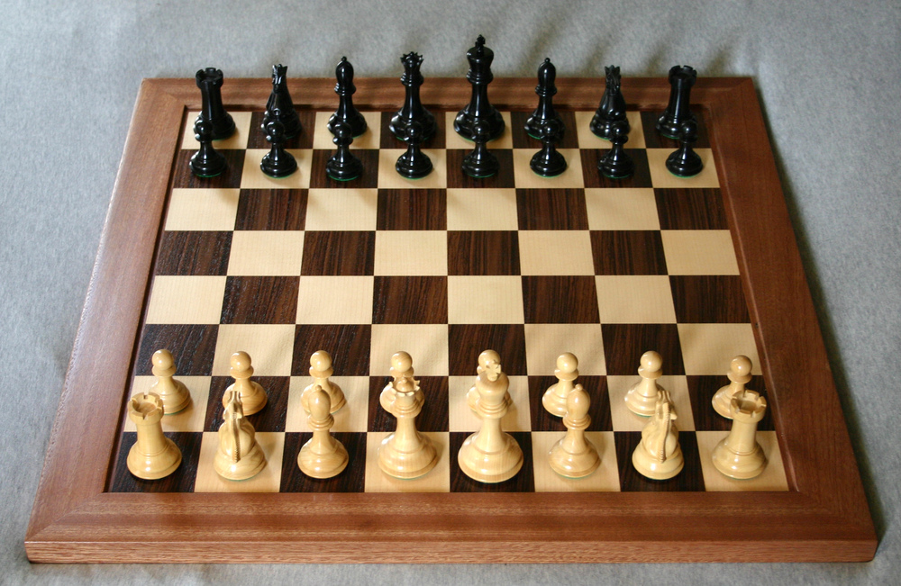
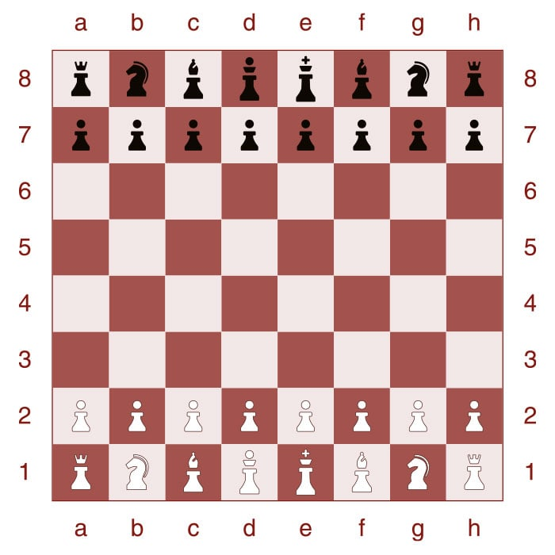
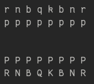
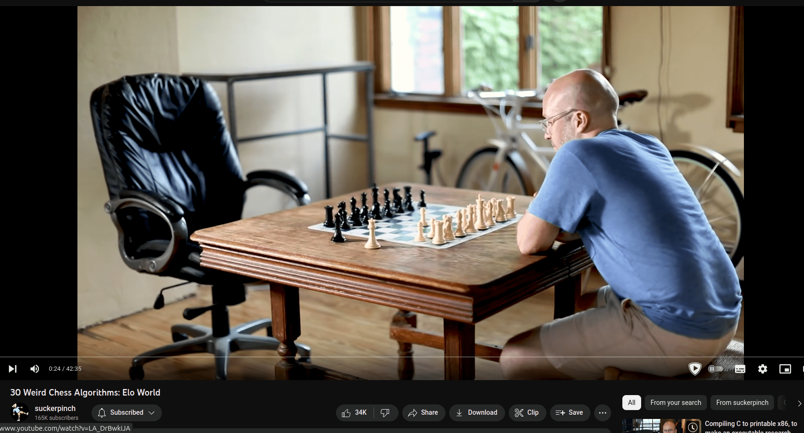
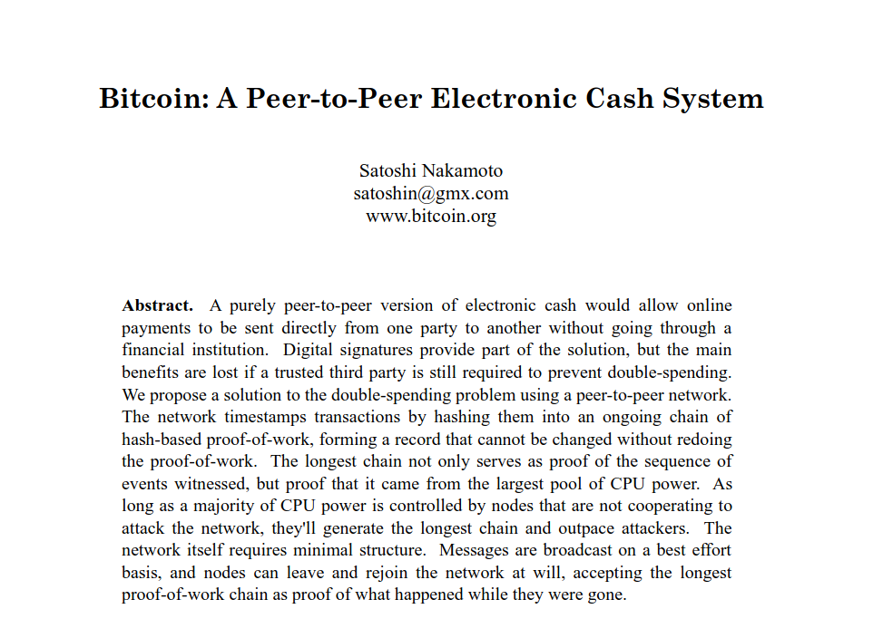

<!--
The comments you see here (except this one) are from the original presentation, as-is.
Just a reminder of how everything is a work in progress; and useful for the author if
we want to re-use the slides another time :)
-->
<!--
Previous references:
https://gnolang.github.io/workshops/presentations/2023-06-05--getting-to-gno-seoul--manfred/presentations.slide.html#1
https://gnolang.github.io/workshops/presentations/2023-09-11--dappcon-key-perpetual-transparency--manfred/presentation.slide.html#1
https://gnolang.github.io/workshops/presentations/2023-07-24--talk-nebular--manfred/presentations.slide.html#1
POC https://gnolang.github.io/workshops/presentations/2023-06-06--buidl-asia--manfred/presentations.slide.html#1

Things I'd like for the design:
- H1 (#) means "Section Divider", title is at centre of page
- H2 (##) is just slide header, should be fixed on top-left
-->

# GnoChess

How to Build a Web3 Chess Server <!-- Tagline TODO -->

Repository: https://github.com/gnolang/gnochess

<!-- TODO
Add QR code linking to repo readme,
on section to start GitPod node.
Set up footer for following slides,
with link to repository + QR Code.
-->

Video: https://www.youtube.com/watch?v=JQh7LhqW7ns

The slides you're reading have a different formatting/theme from the ones on video -- the content is the same!
https://hackmd.io/@tyge/gnochess

Morgan Bazalgette\
Core Team Developer @ Gno.Land

<!-- TODO Add Headshot, social links -->

Note:
Show this as first slides. Do introductions.
Present how the workshop's going to work.

- 3 interactive sessions.
- In each section, you're going to access a different directory inside of the GnoChess root directory, and doing a small (~15 minute) tutorial
- We're not going to be building things from scratch, and you'll soon learn why
- goal for today is to give you a feel and understanding for the Gno programming language and Gno.land chain, and what capabilities Web3 dApp development offers.
- With a variant of the code that we'll be building today, we'll have a contest in the following days where everyone at the conference, including non-techies, is invited to participate. More details later on.
  The main part of the workshop will be around 90 minutes; after that, there will be around 30 minutes to ask questions and for a very informal chat.

---

## Introduction -- What is Gno?

> <!-- .element: class="fragment" -->Baby don't hurt me.

<div class="fragment">

- **Gnolang:** interpreted version of Go, designed for Web3, runs on our own **GnoVM**.
- **Gno.land:** new Layer 1 blockchain, using Gno for development of smart contracts. Focuses on simplicity, security and scalability.
- Secured by **Proof of Contribution** (no environmental disasters).
- Created by Tendermint developer and Cosmos co-founder **Jae Kwon**.
- Grammar is identical\* to **Go 1.17** (ie. pre-generics).
- **Completely deterministic:** no network access, `crypto/rand`, system clock, filesystem, `unsafe`.

</div>

Early phase, still not in "production" ("mainnet", in blockchain lingo).\
Completely FOSS, contributors welcome! <!-- .element: class="fragment" -->

---

## Introduction -- Packages vs Realms

<!-- Screen is split in 2 sides -->

<div style="display:flex">
<div style="width: 50%">

### Packages

- Re-usable pieces of code, like Go
- Will use our Go-inspired `gno.mod` for versioning
- Cannot import realms
- Includes standard library, mimicking Go's (still WIP)

```go
// Package ufmt provides utility functions for
// formatting strings [...]
package ufmt

import "strconv"

// Sprintf offers similar functionality to Go's fmt.Sprintf
// or the sprintf equivalent available in many languages,
// [...]
func Sprintf(format string, args ...interface{}) string {
	end := len(format)
	argNum := 0
	argLen := len(args)
	buf := ""

	for i := 0; i &lt; end; {
		isLast := i == end-1
		c := format[i]

		if isLast || c != '%' {
			buf += string(c)
			i++
			continue
		}
		// ...
```

</div>
<div style="width:50%">

### Realms

- End-user "Smart Contracts"
- Exported functions can be directly called on a Node through RPC
- Persist state through global variables
- Can import other realms for Contract-to-Contract interactions

```go
package counter

import "strconv"

var counter int

func Increment() {
	counter++
}

func Render(string) string {
	return "Times incremented: " + strconv.Itoa(counter)
}
```

</div>
</div>

---

## Introduction -- Dev tools

<div style="display:flex">
<div style="width: 50%">

### `gno`

- Similar to `go` command line: `gno doc`, `gno run`, `gno test`, `gno  repl`
- Used for pure local development
- Not "blockchain-aware"; could potentially be used in other contexts (and non-Gno.land chains).
- We'll use this to write and test our chess server realm.

</div>
<div style="width:50%">

### `gnokey`

- Used to interact with the Gno.land blockchain and manage local private keys.
- Used to publish a package/realm, and perform transactions (realm calls). These will be signed & verified with your key.
- We'll use this to publish our chess server realm and interact with it on the chain.

</div>
</div>

Note:
Talk about how we are working in parellel on an IDE for streamlining development even further; it will work completely in the browser, and it'll be able to run code through WASM

---

## Introduction -- What we'll do today

1. Get acquainted with `gno` and `gnokey`, and publish our first realm. (Next up!)
2. Create a move validator for our chess server.
3. Create new realm functions to play chess with others.

**Gno is alpha quality software.** There are a large number of caveats when developing programs, and not every feature is there yet. If a panic shows up that you have no idea how to fix or what it means, call up on one of us.

---

## Introduction -- Gitpod and tutorials

- Each tutorial should take around ~10 minutes.
- The tutorials are "fill in the gaps"; you'll have some prepared code on which you're expected to do modifications to make it work as intended.
- For this reason, later tutorials don't depend on you completing the previous ones.
- If you're stuck, or you hit a nasty bug, tested solutions are available for all interactive parts.

<!-- TODO:
When some more tutorials are done, add an auto-playing
video or gif (10 seconds), showing how to open GitPod from
GitHub, and how to open up the tutorial, side-by-side.
-->

---

# 🛠 Let's get started! 👩‍💻

## https://github.com/gnolang/gnochess

<!-- TODO add video from before here -->

---

## Let's play chess

<!-- TODO good alignment -->







Note:
This slide is an intro on chess programming and how the first step is to go from the 3D real-life board into the programming representation.

---

## Let's play chess -- Rules

- Pieces have differet movesets:
  - Pawn: move forward, capture diagonally.\
    _Additionally: can move 2 squares at the beginning, promotion, en passant._
  - Rook: horizontally or vertically
  - Knight: L-shaped.
  - Bishop: diagonally.
  - Queen: rook + bishop.
  - King: 1 square in all directions.\
    _Additionally: castling (w/ rook)._

---

## Let's play chess -- Rules

- Set of legal moves is not a function of just the board (`[64]Piece`):
  - En passant captures can only be done on one specific halfmove
  - If the king moves, player loses the ability to castle for the entire game.
  - If a rook moves, player loses the ability to castle _in that direction_ for the entire game.
- Automatic draw conditions
  - 50/75 move rule
  - 3/5 fold repetition _(exercise for the reader)_

Note:
In this slide, I'll switch to a few predetermined Lichess positions, to show all the moves (even the weirder and less known ones).
The point is to say that to implement a good move validator, the ruleset to implement is a bit trickier than one might expect.

---

## Let's play chess -- Programming

> **Chess Programming Wiki** \
> Great resource to dig deep & learn what others have done in the past \
> https://chessprogramming.org

- Board is 8x8, so 64 pieces, and 6 "classes" of pieces (\* 2)
  - Optimised engines make use of bitboards (`uint64`), we'll be dumber (`[64]Piece`)
- On the backend, we only need to implement "move validation"
  - Because of checks, we need to actually implement full move generation
    <!-- TODO: add position picture to exemplify -->
  - i.e. we're creating a chess engine, minus position evaluation
- Common "position" representation: **Forsyth-Edwards Notation (FEN)** \
  `r1bqkbnr/pp1p1Qpp/2n5/2p1p3/2B1P3/8/PPPP1PPP/RNB1K1NR b KQkq - 0 4`
  - Pieces on board, player to play, **castling rights,** **en passant square**, **halfmove clock**, fullmove counter.

Note:
Position evaluation: engines like stockfish, in order to determine how "good" a move is, eventually need to be able to evaluate a position without recursively searching deeper. So proper engines implement an evaluation function.
This slide serves to explain some concepts about chess programming, and make some of the decisions of the data structures that the users will be re-using look a little less arbitrary

---

## Let's play chess -- Data structures

> I will, in fact, claim that the difference between a bad programmer and a good one is whether he considers his code or his data structures more important. Bad programmers worry about the code. Good programmers worry about data structures and their relationships.
> _-- Linus Torvalds_

```go [1|2-6|7-14|15-18|19-22]
type Board [64]Piece
type Position struct {
	B     Board
	Moves []Move
	Flags PositionFlags // E.p. column, castling rights
}
type Piece byte
const (
	PieceEmpty Piece = iota
	PiecePawn
	PieceRook
	// [...]
	PieceBlack Piece = 8 // bit-flag
)
type Move struct {
	From, To  Square
	Promotion Piece
}
// range [0,64). 44 (decimal):
//	44 = 0b00 101  100  = d5
//	          ^row ^col
type Square byte
```

---

# 🕵️‍♂️ Write a move validator 🤔

## https://github.com/gnolang/gnochess

<!-- TODO add video from before here -->

---

## Playing together

[](https://www.youtube.com/watch?v=DpXy041BIlA)

Note:
Slide talking about: of course, playing chess alone is boring and not that interesting, and referencing this video by tom7 if anyone is interested in more chess playing

---

## Playing together -- It's all in the store!

```go
func newGame(caller, opponent std.Address, seconds, increment int) *Game {
	games := getUserGames(caller)
	// Ensure player has no ongoing games.
	assertGamesFinished(games)
	assertGamesFinished(getUserGames(opponent))

	if caller == opponent {
		panic("can't create a game with yourself")
	}

	isBlack := determineColor(games, caller, opponent)

	// Set up Game struct. Save in gameStore and user2games.
	gameIDCounter++
	// id is zero-padded to work well with avl's alphabetic order.
	id := zeroPad9(strconv.FormatUint(gameIDCounter, 10))
	g := &Game{
		ID:        id,
		White:     caller,
		Black:     opponent,
		Position:  NewPosition(),
		State:     GameStateOpen,
		Creator:   caller,
		CreatedAt: time.Now(),
	}
	if isBlack {
		g.White, g.Black = g.Black, g.White
	}

	gameStore.Set(g.ID, g)
	addToUser2Games(caller, g)
	addToUser2Games(opponent, g)

	return g
}
```

<!-- .element: style="height:100vh" -->

---

## Playing together -- It's all in the store!

```go
func MakeMove(gameID, from, to string, promote Piece) string {
	std.AssertOriginCall()

	g := getGame(gameID, true)

	// determine if this is a black move
	isBlack := len(g.Position.Moves)%2 == 1

	caller := std.GetOrigCaller()
	if (isBlack && g.Black != caller) ||
		(!isBlack && g.White != caller) {
		// either not a player involved; or not the caller's turn.
		panic("you are not allowed to make a move at this time")
	}

	// validate move
	m := Move{
		From: SquareFromString(from),
		To:   SquareFromString(to),
	}
	if m.From == SquareInvalid || m.To == SquareInvalid {
		panic("invalid from/to square")
	}
	if promote > 0 && promote <= PieceKing {
		m.Promotion = promote
	}
	newp, ok := g.Position.ValidateMove(m)
	if !ok {
		panic("illegal move")
	}

	// add move and record new board
	g.Position = newp

	o := newp.IsFinished()
	if o == NotFinished {
		// opponent of draw offerer has made a move. take as implicit rejection of draw.
		if g.DrawOfferer != nil && *g.DrawOfferer != caller {
			g.DrawOfferer = nil
		}

		return g.json()
	}

	switch {
	case o == Checkmate && isBlack:
		g.State = GameStateCheckmated
		g.Winner = WinnerBlack
	case o == Checkmate && !isBlack:
		g.State = GameStateCheckmated
		g.Winner = WinnerWhite
	case o == Stalemate:
		g.State = GameStateStalemate
		g.Winner = WinnerDraw

	case o == Drawn75Move:
		g.State = GameStateDrawn75Move
		g.Winner = WinnerDraw
	case o == Drawn5Fold:
		g.State = GameStateDrawn5Fold
		g.Winner = WinnerDraw
	}
	g.DrawOfferer = nil
	g.saveResult()

	return g.json()
}
```

<!-- .element: style="height:100vh" -->

---

# 🧩 Play around and implement `Draw`, `DrawOffer` and `Resign` ♟

## https://github.com/gnolang/gnochess

---

## Why do we need Web3 chess servers?

<p class="fragment"><strong>Short answer:</strong> we don't.</p>

- This is an experiment and a demo of what is possible with Blockchain. <!-- .element: class="fragment" -->
- Some of the features that this enables may not be appararent: <!-- .element: class="fragment" -->
  - As long as the underlying blockchain can be trusted, you can verify the code.
  - On the Gno.land chain (different ie. from Ethereum) you can only upload source code Gno code.
  - **You can verify backend code!** (ie. the server is doing what it says it is, and not implementing shady user tracking!)
  - Data is persistent and may survive by many years its authors

---

## Why do we need Web3 chess servers?


---

## Why do we need Web3 chess servers?

> https://bitcoin.org/bitcoin.pdf



---

## Why do we need Web3 chess servers?

> https://ourincrediblejourney.tumblr.com/


---

## Why do we need Web3 chess servers?

> https://bitcoin.org/bitcoin.pdf

> Commerce on the Internet has come to rely almost exclusively on financial institutions serving as trusted third parties to process electronic payments. While the system works well enough for most transactions, it still suffers from the inherent weaknesses of the trust based model. Completely non-reversible transactions are not really possible, since financial institutions cannot avoid mediating disputes. The cost of mediation increases transaction costs, limiting the minimum practical transaction size and cutting off the possibility for small casual transactions, and there is a broader cost in the loss of ability to make non-reversible payments for non-reversible services. With the possibility of reversal, the need for trust spreads. Merchants must be wary of their customers, hassling them for more information than they would otherwise need.

---

## Why do we need Web3 chess servers?

> https://bitcoin.org/bitcoin.pdf

> A certain percentage of fraud is accepted as unavoidable. These costs and payment uncertainties can be avoided in person by using physical currency, but no mechanism exists to make payments over a communications channel without a trusted party.

What Web3 enables is what Web2 never could: \
**Achieve trust in a trustless environment.**

Additionally, it enables perpetual, self-funded applications.

---

# Thanks!

- Our website: https://gno.land
- GnoChess Repository: https://github.com/gnolang/gnochess
- Main repository: https://github.com/gnolang/gno
- Contributions and rewards
  - We use **Proof of Contribution:** governance of the chain is managed first and foremost by its contributors, rather than folks who already own lots of capital
  - Check out main repo issues -> Game of Realms
  - Fund grants: https://github.com/gnolang/ecosystem-fund-grants
  - Also, we're hiring!

## Come and play! https://gnochess.com

### Register after the workshop or at our booth.

### We'll be holding a raffle at the end of Gophercon with prizes.

### More contributions, and more playing -> higher chance of winning.

See `GOPHERCON_COMPETITION.md` in Chess repository.
