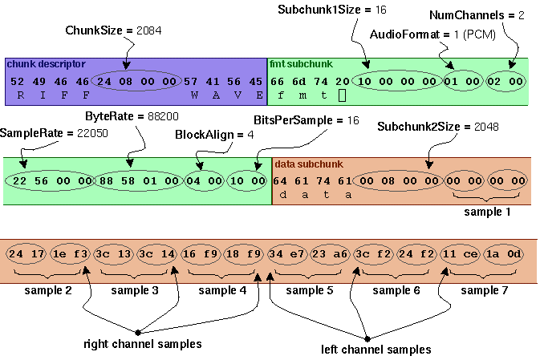

name: inverse
layout: true
class: center, middle, inverse
---
# go -> gno

### generating bytebeat music with smart contracts

zack scholl ([@schollz](https://github.com/schollz))

october 12th, 2023

---

layout: false
.left-column[
## what is ...
### ...gno?
]
.right-column[

### [Gno](https://github.com/gnolang/gno) is an interpreted version of the programming language Go.

Gno was created by Cosmos co-founder Jae Kwon. 

Gno is optimized for blockchain - it has deterministic execution for executing on distributed systems. 

*practically speaking*, Gno is Go without `crypto/rand`, web calls, and imports from non-deterministic libraries. Gno code is transpiled into Go code which then leverages the Go compiler system.

**If you can write Go code, you can write Gno code.**

If you write Gno code, you can immediately write "smart contracts".

]
---

.left-column[
## what is ...
### ...gno?
### ...a smart contract?
]
.right-column[

### "smart contracts" are essentially computer programs stored on a blockchain.

they are executed according to what is defined in the code, and their code cannot be changed.

smart contracts can be used to automate transactions, but are not limited to DeFi. they can be used to create incentivized social networks and rework how we interact with the web (i.e. "web3").

smart contracts written in Gno run within the Gno.land ecosystem.

]

---

.left-column[
## what is ...
### ...gno?
### ...a smart contract?
### ...gno.land?
]
.right-column[

### [Gno.land](https://gno.land) is a platform to write smart contracts in Gno.

It is the first of a series of Gno Layer 1 chains.

It is built on Tendermint2, Cosmos/IBC, secured by Proof of Contribution.

It prioritizes simplicity, security, scalability, and transparency.


For example: https://test3.gno.land/r/demo/boards:testboard

Currently no main net, but we will get started by running the entire system locally.

]

---


.left-column[
## what is ...
### ...gno?
### ...a smart contract?
### ...gno.land?
### ...bytebeat?
]
.right-column[

### [bytebeat](http://canonical.org/~kragen/bytebeat/) is a minimal programming language for synthesized music.

was discovered by [viznut](http://countercomplex.blogspot.com/2015/04/bringing-magic-back-to-technology.html) in 2011 as a way to type a very short computer programs that generate chiptune music, for example this is a bytebeat program:

```c
main(t){
  for(;;t++) putchar(((t<<1)^((t<<1)+(t>>7)&t>>12)));
}
```

which you can take the raw output of and convert to audio:

```bash
gcc -o crowd crowd.c
./crowd | head -c 4M > crowd.raw
sox -r 8000 -c 1 -t u8 crowd.raw crowd.wav
```

<audio controls>
<source src="crowd.mp3" type="audio/mpeg">
Your browser does not support the audio element.
</audio> 
]


---


.left-column[
## what is ...
### ...gno?
### ...a smart contract?
### ...gno.land?
### ...bytebeat?
### ...is that we are going to do today?
]
.right-column[

### today we are going to use Gno to host a smart contract on Gno.land that implements bytebeat music.

if you know Go, you know Gno.

I will help you get started with the tooling, the ecosystem, and some first steps into what can be done with smart contracts.

]
---

.left-column[
## what is ...
## local gno
### prerequisites
]
.right-column[

### lets setup a computer to write and run Gno code on a local Gno.land instance.

**what you need before we begin:**

- linux system (mac os or gitpod may also be okay)
- [visual studio code](https://code.visualstudio.com/) ide (best supported currently).
- [golang](https://go.dev/doc/install) v1.21.2+

open ide and install `gnopls` and `gofumpt`. then search for and install the `Gno` VScode extension.

```bash
> go install -v github.com/harry-hov/gnopls@latest
> go install -v mvdan.cc/gofumpt@latest
```

]
---

.left-column[
## what is ...
## local gno
### prerequisites
### install gno
]
.right-column[

### download and build gno

today we will use a forked version of Gno that removes limits for allocation and CPU usage and has some ready code for today's tutorial:

```bash
> git clone https://github.com/schollz/gno
> cd gno
> git checkout bytebeat-workshop
```

open up the `gno` folder in the visual studio code ide. lets build everything first:

```bash
> make build
```

this will install the `gno` toolchain, build the `gno.land` that runs the `gno.land` node (locally), and build the `gnoweb` server that runs the frontend interface to gno.land.

]
---

.left-column[
## what is ...
## local gno
### prerequisites
### install gno
### creating a key
]
.right-column[

### Gno.land requires keys to keep track of tokens.

keys are central to blockchains that to track tokens. lets generate one.


```bash
> gnokey generate
brush laugh ...
```


copy the bip39 mnemonic (`brush laugh...`). Now we will actually add the key:

```bash
> gnokey add --recover mykey
```

enter a passphrase twice and then the bip39 mnemonic you copied.

now you should see your key when listing them:

```bash
> gnokey list 
0. mykey (local) - addr: youraddress ...
```

]
---

.left-column[
## what is ...
## local gno
### prerequisites
### install gno
### creating a key
### adding tokens
]
.right-column[

### Gno.land requires tokens for gas fees.

since we are spinning up our own testnet, we can add tokens directly to our key from the genesis block.

open `gno.land/genesis/genesis_balances.txt` and add a new line with your address:

```bash
youraddress=10000000000ugnot 
```

now when we run gno.land the address associated with `mykey` will be allocated with 10,000,000,000 gnots.

]
---

.left-column[
## what is ...
## local gno
## writing gno
### packages v. realms
]
.right-column[

### smart contract = packages + realms

writing a smart contract is Gno is as easy as writing a package in Go.

however, Gno distinguishes between a *package* and a *realm*.

A *package* is Gno code that does not have state. Usually it is code that may be used by many realms. However you can also import realms. This can have any functions or structures exported to be used within realms.

A *realm* represents the actual smart contract - it is Gno code with state, storage, and can use tokens. Realms have a `Render(path string) string` function that can be called from `gno.land`.  Globals persist.


lets write a smart contract.

]
---


.left-column[
## what is ...
## local gno
## writing gno
### packages v. realms
### bytebeat overview
]
.right-column[

### bytebeat smart contracts

lets write some packages and realms in Gno that makes it easy to generate a smart contract to generate bytebeat audio on gno.land.

in the future this could be extended to a small web3 social network of music + code sharing where contributions are incentivized and audio streams are rewarded back to their creators.

but first, lets write some gno.
]
---

.left-column[
## what is ...
## local gno
## writing gno
### packages v. realms
### bytebeat overview
]
.right-column[

### generating audio files

streaming audio comes in many formats, but one of the most common for uncompressed audio is the WAVE File format (`.wav`) which is a subset of the RIFF file format. the canonical [wave file format is well-defined](http://soundfile.sapp.org/doc/WaveFormat/):

<center>

</center>

]
---

.left-column[
## what is ...
## local gno
## writing gno
### packages v. realms
### bytebeat overview
### riff package
]
.right-column[

### WAVE audio files need a RIFF.

lets write our first Gno package to make it easier to write RIFF files. it will be a simply `io.Writer` wrapper to help writing chunks needed for a RIFF header:


```go
(w *Writer) WriteChunk(chunkID []byte, chunkSize uint32)  (n int, err error)
```


we will work in the `examples/gno.land/p/demo` folder (`/p/` designates package, and `/r/` will designate a realm). lets create the `audio` folder and a `riff` folder in there to hold our gno file.

lets now create the `examples/gno.land/p/demo/riff/riff.gno` file. 

]
---

.left-column[
## what is ...
## local gno
## writing gno
### packages v. realms
### bytebeat overview
### riff package
]
.right-column[

lets create and write code for RIFF:

```bash
./examples/gno.land/p/demo/audio/riff/riff.gno
```

]
---

.left-column[
## what is ...
## local gno
## writing gno
### packages v. realms
### bytebeat overview
### riff package
]
.right-column[

### Run tests in Gno like you do in Go.

testing is done the same way as Go. you create a test package `yourfile_test.gno` and you can then create automated tests.

there is already one setup for the `riff` package:

```bash
./examples/gno.land/p/demo/audio/riff/riff_test.gno
```

you can run a test using the `gno` tool:

```bash
> gno test --verbose examples/gno.land/p/demo/audio/riff
== RUN   TestRiff
PASS: TestRiff (0.00s)
ok      ./examples/gno.land/p/demo/audio/riff   1.13s
```

]
---

.left-column[
## what is ...
## local gno
## writing gno
### packages v. realms
### bytebeat overview
### riff package
### wav package
]
.right-column[

### creating a wav package.

now that we have `examples/gno.land/p/demo/riff/riff.gno` we can create another package for handling wav files. this file is `examples/gno.land/p/demo/wav/wav.gno` and is based on [an open-source Go package for handling wav files](https://github.com/youpy/go-wav). this file will ease the creation of wave files and adding samples. we will create a writer:

```go
func NewWriter(w io.Writer, 
  numSamples uint32, 
  numChannels uint16, 
  sampleRate uint32, 
  bitsPerSample uint16) (writer *Writer, err error) ...

```

and a function for writing samples:

```go
func (w *Writer) WriteSamples(samples []Sample) (err error)
```

]
---

.left-column[
## what is ...
## local gno
## writing gno
### packages v. realms
### bytebeat overview
### riff package
### wav package
]
.right-column[

lets look at the code for the wav package

```bash
./examples/gno.land/p/demo/audio/wav/wav.gno
```

]
---

.left-column[
## what is ...
## local gno
## writing gno
### packages v. realms
### bytebeat overview
### riff package
### wav package
### bytebeat package
]
.right-column[

### creating a bytebeat package.

now we can utilize the packages we've created (`riff` and `wav`) and create a bytebeat package that utilizes them.

the bytebeat package will export a single function that can take an argument for processing a bytebeat function:

```go
func ByteBeat(seconds uint32, 
  sampleRate uint32, 
  bytebeat_func func(t int) int) (data string) 
```

since this package is designed to be used with the bytebeat realm, we will return a `string` since gno.land communicates through strings. in this case the string will be the base64-encoded WAVE file format audio.

]
---

.left-column[
## what is ...
## local gno
## writing gno
### packages v. realms
### bytebeat overview
### riff package
### wav package
### bytebeat package
]
.right-column[

lets look at the code for the bytebeat package:

```bash
./examples/gno.land/p/demo/audio/bytebeat/bytebeat.gno
```

]
---

.left-column[
## what is ...
## local gno
## writing gno
### packages v. realms
### bytebeat overview
### riff package
### wav package
### bytebeat package
]
.right-column[

### testing the bytebeat package

we will write a test for this package that enables us to generate + playback the audio. find [a bytebeat](http://macumbista.net/wp-content/uploads/2016/11/music_formula_collection.txt) and print it out:

```go
func TestByteBeat(tt *testing.T) {
  data := ByteBeat(10, 8000, func(t int) int {
    return (t>>10^t>>11)
  })
  if strings.Contains(data, "error") {
    tt.Fatalf("%s", data)
  }
  println(data)
}
```

then we can output, convert, and playback the audio:

```bash
> gno test --verbose examples/gno.land/p/demo/audio/bytebeat | \
    base64 -d > bytebeat.wav
> play bytebeat.wav
```
]
---

.left-column[
## what is ...
## local gno
## writing gno
### packages v. realms
### bytebeat overview
### riff package
### wav package
### bytebeat package
### bytebeat realm
]
.right-column[

### creating a bytebeat realm.

a realm needs a `Render` function that can be used to render markdown to the web frontend.

it also has global persistence, so we can easily add a comment function:

```go
var comments []Comment // global persists data without ORM
func AddComment(msg string) string {
  caller := std.GetOrigCaller() // smart-contract call
  comments = append(comments, Comment{
    User:    string(caller),
    Message: msg,
  })
  ...
}
```

]


---
.left-column[
## what is ...
## local gno
## writing gno
### packages v. realms
### bytebeat overview
### riff package
### wav package
### bytebeat package
### bytebeat realm
]
.right-column[

lets write some code for the bytebeat realm:

```bash
./examples/gno.land/r/demo/bytebeat/bytebeat.gno
```

]

---

.left-column[
## what is ...
## local gno
## writing gno
## running gno
]
.right-column[

### package + realms finished

now we are finished with packages and realms, we can spin up a test net and upload them as a smart contract to interact with.


]
---

.left-column[
## what is ...
## local gno
## writing gno
## running gno
### local net
]
.right-column[
### spinning up a test net

first we will spinup a test net on our local machine to upload our package + realms.

```bash
> make run
```

which is a quick way to kill old servers, delete their content, and then spin up the gno.land server and web interface. i.e.: 

```bash
pkill -f 'build/gnoland'
pkill -f 'build/gnoweb'
rm -rf gno.land/testdir
cd gno.land && ./build/gnoland start >/dev/null 2>&1 & 
sleep 5
cd gno.land && ./build/gnoweb & 
sleep 3
```
]
---

.left-column[
## what is ...
## local gno
## writing gno
## running gno
### local net
### pushing packages & realms
]
.right-column[

here is the command for pushing the first package from the file in `examples/gno.land/p/demo/audio/riff`:

```bash
gnokey maketx addpkg \
  --pkgpath "gno.land/p/demo/audio/riff/v1" \
  --pkgdir "examples/gno.land/p/demo/audio/riff" \
  --deposit 100000000ugnot \
  --gas-fee 1000000ugnot \
  --gas-wanted 2000000 \
  --broadcast --chainid dev --remote localhost:26657 
  YOURKEY
```

the argument `pkgpath` defines how our package or realm is imported. the `pkgdir` defines where it sits on the disk.

the `deposit`, `gas-fee`, and `gas-wanted` are related to allocations needed for processing the package or realm.

be sure to change `YOURKEY` to the key that you setup (`gnokey list` lists all of them).

]
---

.left-column[
## what is ...
## local gno
## writing gno
## running gno
### local net
### pushing packages & realms
]
.right-column[

quick note: if you change your code and want to update your realm, you can just use `--pkgpath` to generate a new version.

```bash
gnokey maketx addpkg \
  --pkgpath "gno.land/p/demo/audio/riff/v2" \
  --pkgdir "examples/gno.land/p/demo/audio/riff" \
  --deposit 100000000ugnot \
  --gas-fee 1000000ugnot \
  --gas-wanted 2000000 \
  --broadcast --chainid dev --remote localhost:26657 
  YOURKEY
```

in this case, `gno.land/p/demo/audio/riff/v1` was changed to `gno.land/p/demo/audio/riff/v2`, but defined from the same directory.


]
---

.left-column[
## what is ...
## local gno
## writing gno
## running gno
### local net
### pushing packages & realms
]
.right-column[

to ease pushing packages and realms during development, you can add a flag `--insecure-password-stdin=true`. this way you can save the password to a file, e.g. `password` and pass it in to run from a script, e.g.:

```bash
cat password | gnokey maktex addpkg \
  ... (same as before) ... \
  ---insecure-password-stdin=true YOURKEY
```

for now, this is encapsulated in the `Makefile` when you run

```bash 
KEY=YOURKEY make push
```

(make sure your password is saved into a local file `password`).


]

---

.left-column[
## what is ...
## local gno
## writing gno
## running gno
### local net
### pushing packages & realms
### realms on gno.land
]
.right-column[

### realms pushed to gno.land are available by their path.

The `pkgpath` for the bytebeat realm was set in the `gnokey maketx` as `gno.land/r/demo/bytebeat/v1`. 

It is now available on the Gno.land web interface at 

<center>

<a href="http://localhost:8888/r/demo/bytebeat/v1" target="_blank">localhost:8888/r/demo/bytebeat/v1</a>

</center>

check it out!


]
---

.left-column[
## what is ...
## local gno
## writing gno
## running gno
### local net
### pushing packages & realms
### gno.land + realms
### maketx + realms
]
.right-column[

### exported functions in realms can be accessed by the `gnokey` command.

remember we exported `AddComment`? we can utilize that function with our key and the Gno.land server:

```bash 
gnokey maketx call --pkgpath "gno.land/r/demo/bytebeat/v1" \
  --func "AddComment" --args "hello, world!" \
  --gas-fee 1000000ugnot --gas-wanted 8000000  \
  --broadcast --chainid dev --remote localhost:26657 \
  YOURKEY
```

You can specify `--pkgpath` to target a realm and then use `--func` to specify the exported function. Arguments for the function are sequential `--args` arguments. 

]
---

.left-column[
## what is ...
## local gno
## writing gno
## running gno
## more gno
### more bytebeats
]
.right-column[

### create more bytebeat realms!


[find more bytebeat formulas here for inspiration](https://macumbista.net/wp-content/uploads/2016/11/music_formula_collection.txt).

```go
  data = bytebeat.ByteBeat(seconds, 8000, func(t int) int {
    return ... // <- your bytebeat function!!
  })
```

and then upload a new realm:

```bash
gnokey maketx addpkg \
  --pkgpath "gno.land/p/demo/audio/bytebeat/whatever" \
  --pkgdir "examples/gno.land/r/demo/bytebeat" \
  --deposit 100000000ugnot \
  --gas-fee 1000000ugnot \
  --gas-wanted 2000000 \
  --broadcast --chainid dev --remote localhost:26657 
  YOURKEY
```

anyone can now use those packages and realms to upload their own smart contract that generates bytebeat!

]

---


.left-column[
## what is ...
## local gno
## writing gno
## running gno
## more gno
### more bytebeats
### resources
]
.right-column[

### Gno and Gno.land are more than anything here.

- continue exploring with [the dozens of examples](https://github.com/gnolang/gno/tree/master/examples)
- more information on [getting started](https://github.com/gnolang/gno/blob/master/examples/gno.land/r/demo/boards/README.md)
- checkout what [people are building](https://github.com/gnolang/awesome-gno)
- read previous [talks about Gno](https://github.com/gnolang/workshops)
- join [the discord](https://discord.com/invite/YFtMjWwUN7)


]
---

.left-column[
## what is ...
## local gno
## writing gno
## running gno
## more gno
### more bytebeats
### resources
### thanks!
]
.right-column[

### thank you for listening and following along!

special thanks to the amazing growing Gno team - Jae ([@jaekwon](https://github.com/jaekwon)), Manfred ([@moul](https://github.com/moul)), Morgan ([@thehowl](https://github.com/thehowl)), Miloš ([@zivkovicmilos](https://github.com/zivkovicmilos)), Antonio ([@ajnavarro](https://github.com/ajnavarro)), Michelle, Johnny, Valeh, and so so many more!!


]


