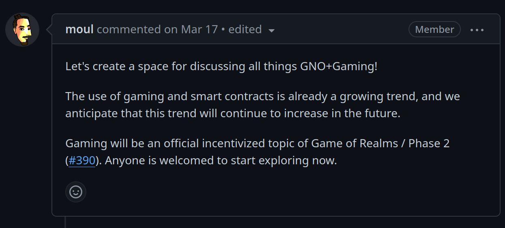
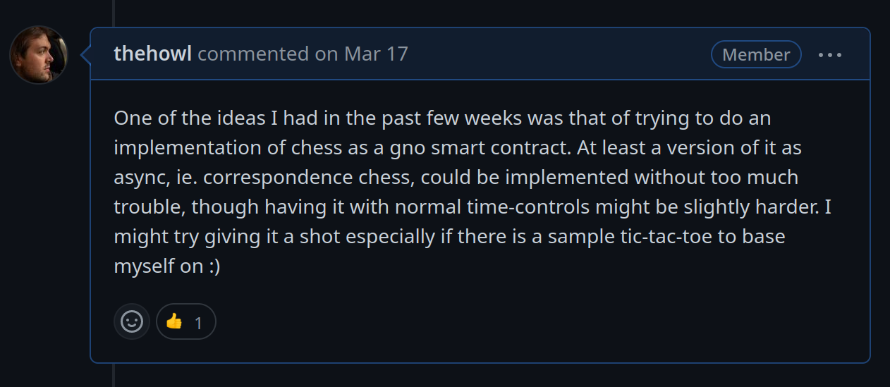
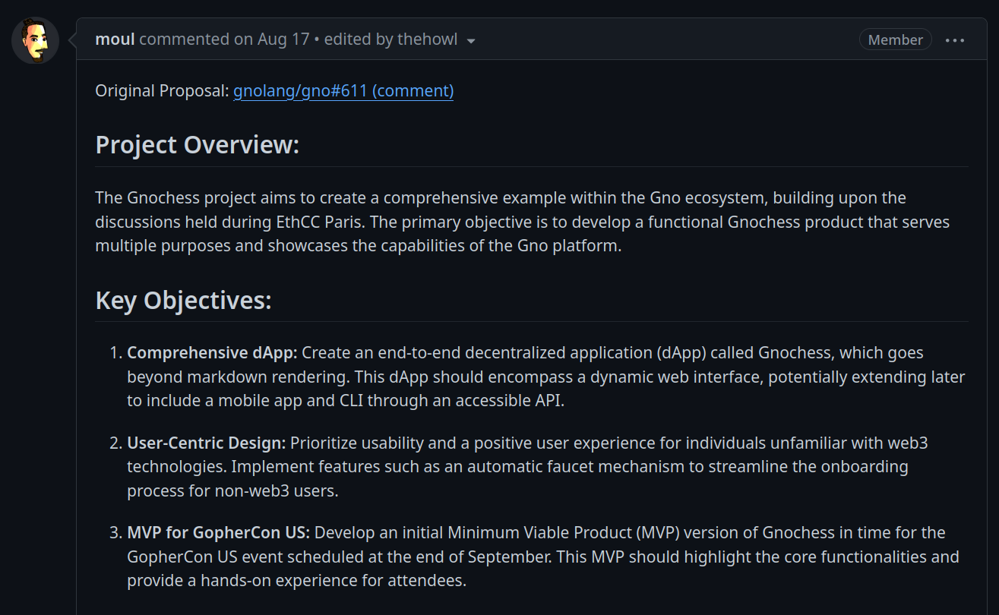
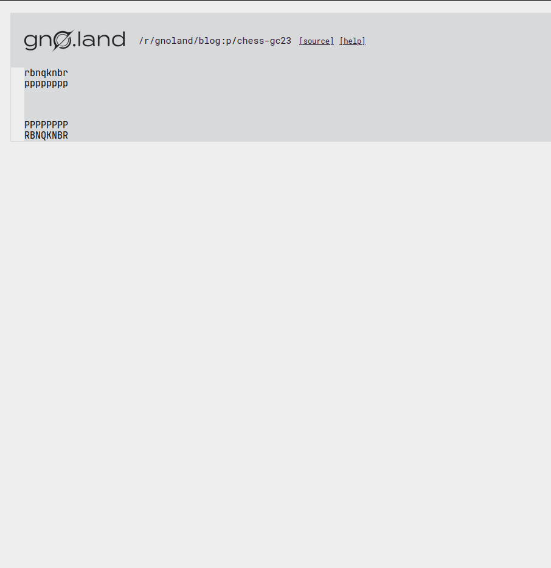
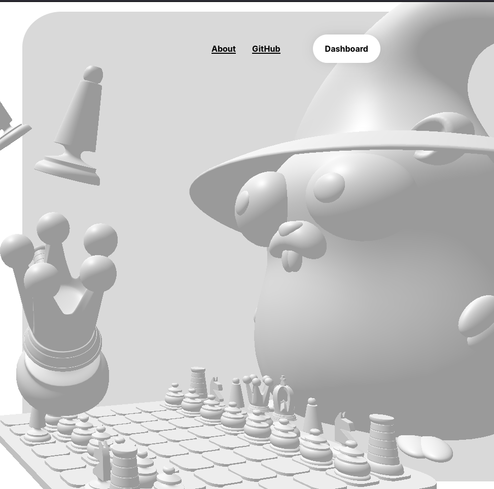
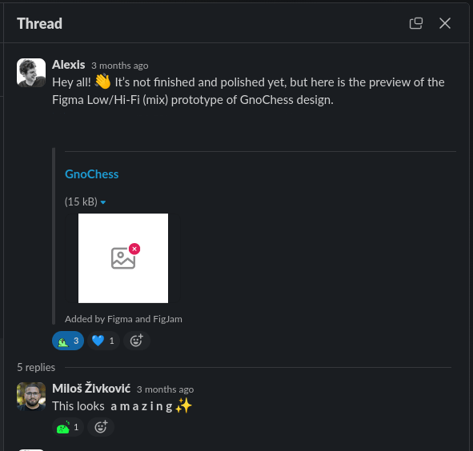
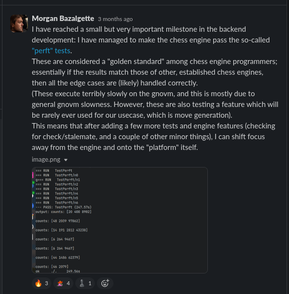
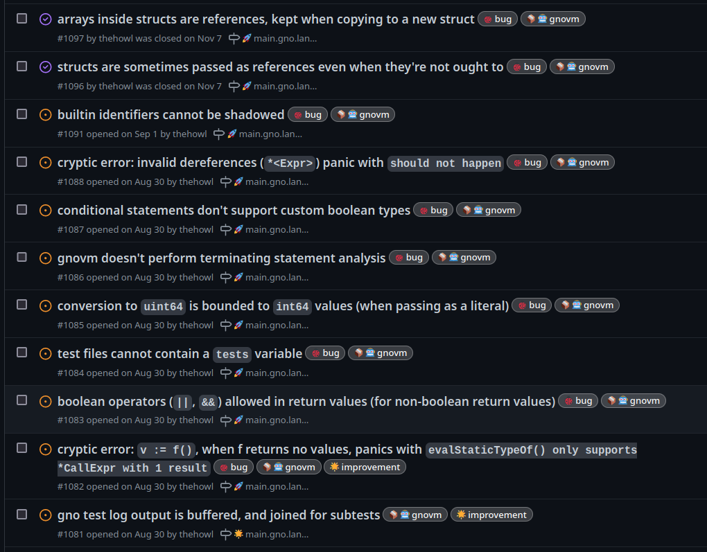

<style>
.reveal img {
	max-height: 100vh;
}
</style>

<!--
1. A narrative of the story, the initial objectives, the initial development
2. The madness week
3. The conference, the presentation, the raffle
4. What went right
5. What went wrong
6. Key takeaways: we need to build dApps, we need to experiment with Gno and
   break it. There are very few people using gno right now, and if we want that
   number to increase we need to tackle both documentation and stability.
   We need a lot of very foundational stuff, and the best way to build
   foundational stuff is by experimenting and trying to build real-world useful
   things.
   also: I'm not that good at coping under stress and managing others, but this
   has taught me a lot and I hope we can even further improve this with a new
   TPM.
   We need to clarify how to work well with marketing to make sure that the
   communications are properly relayed and conveyed and increase our full
   transparency even when talking about things which seem implied.
   We need to discuss ways to improve our documentation in a way that is useful
   to different kinds of people. Being the first blockchain to use an existing
   language (Rust doesn't count), and with the ambitious goal we set out, we
   need to understand that we have a primary goal in getting web2 developers to
   be excited about what we're doing and realise how we're providing a better
   solution to many problems that the web2 companies have faced over the last
   years.
7. The positive impact we're having (GnoChess code already being used, twitter
   clone as well as Flippando use both GnoChess, and maybe more I haven't heard
   about)
8. A path for a second launch
-->

# GnoChess

## A retrospective.

Morgan Bazalgette, 13/12/2023

---

# This is going to be long

#### _But I'm going to try to keep it entertaining._

<!-- TODO index showing each title of the presentation -->

---

# Part 1: how it all started

#### <!-- .element: class="fragment" --> Or: _How I began digging my own grave_

<!--
Part 2: ethCC
- Talk about how everything started from ethCC
- Picture of us as a team at the conference, and of me and Albert playing (and me winning)
- Screenshot from the issue about Gno gaming issue, talk about how Valeh proposed for me to do this for Gophercon
- Show email thread of Valeh talking to the conference organisers and them being majorly excited for doing this.
- From the get-go: create a chess "tournament" as well as a workshop to show
	people how to create a chess server of their own, showing the power of
	backend app development in Gno. (some screenshots of a Go HTTP handler vs
	Gno realm FN, to show a comparison)
-->

---



---

 \


---

## FORESHADOWING FORESHADOWING <!-- .element: class="fragment" data-fragment-index="2" -->
## FORESHADOWING FORESHADOWING <!-- .element: class="fragment" data-fragment-index="2" -->

> **Mar 17:** _(a couple of weeks after I joined Gno)_ \
> At least a version of it as async, ie. correspondence chess, could be implemented
> **<!-- .element: class="fragment" data-fragment-index="1" -->without too much trouble**

## FORESHADOWING FORESHADOWING <!-- .element: class="fragment" data-fragment-index="2" -->
## FORESHADOWING FORESHADOWING <!-- .element: class="fragment" data-fragment-index="2" -->

---



---

# The Plan

- Creating a **chess server dApp**, which seamlessly connected to a backend Gno.land node without requiring anything other than a browser.
  - As a consequence, creating a special-purpose faucet which could allocate, to users with a known “password” from a list, a determined amount of funds.
- Using the Gno.land node to run real-time chess games
  - ... while not having the possibility of performing any **deferred/parallel processing,** not initiated by the end user.
  - ... while trying to **minimise as much as possible the time between a move made, and the move showing up in a browser.**
  - ... while performing full move validation on the backend. This effectively translates to making a **full chess engine in Gno!**

---

# The Plan

- Using the Gno.land node to: manage players, match-making them using Glicko2 ratings (same as “real” chess servers!).
- Make this all work reliably enough so that people could compete to win a macbook (among other things) without getting fed up with us because there are unfair/frustrating bugs of any sort.
- All of this, in order to create:
  - an interesting workshop, showing full E2E dApp development on Gnoland, interesting both for Gophercon but for all Gophers who want to have an interest in us/blockchain
  - something to show & engage people talking with us at the booth (or who just happened to be sneaked up on by our marketing team) at a deeper level than just having a chat about what we did.

---

# And show that Gno can be very cool

<div style="display:flex">
<div style="width: 50%">

```go
// MakeMove specifies a move to be done on the given game, specifying in
// algebraic notation the square where to move the piece.
// If the piece is a pawn which is moving to the last row, a promotion piece
// must be specified.
// Castling is specified by indicating the king's movement.
func MakeMove(gameID, from, to string, promote Piece) string {
	// all the parameters are ready to use --
	// no request parsing!
```

</div>
<div style="width: 50%">

```go
type makeMoveData struct {
        GameID  string `json:"game_id"`
        From    string `json:"from"`
        To      string `json:"to"`
        Promote Piece  `json:"promote"`
}
```

```go
// MakeMove specifies a move to be done on the given game, specifying in
// algebraic notation the square where to move the piece.
// If the piece is a pawn which is moving to the last row, a promotion piece
// must be specified.
// Castling is specified by indicating the king's movement.
func MakeMove(w http.ResponseWriter, r *http.Request) {
	var data makeMoveData
	if err := json.NewDecoder(r.Body).Decode(&data); err != nil {
		w.WriteHeader(500)
		w.Write([]byte(`{"error":"bad request data"}`))
	}
```

</div>
</div>

---

# And show that Gno can be very cool

<div style="display:flex">
<div style="width: 50%">

```go
func getGame(id string, wantOpen bool) *Game {
	graw, ok := gameStore.Get(id)
	if !ok {
		panic("game not found")
	}
	g := graw.(*Game)
	if wantOpen && g.State.IsFinished() {
		panic("game is already finished")
	}
	return g
}
```

</div>
<div style="width: 50%">

```go
var errGameNotFound = errors.New("game not found")
var errGameFinished = errors.New("game is already finished")
// example using entgo.io (the best Go ORM)
func getGame(ctx context.Context, db *ent.Client,
	id string, wantOpen bool) (*ent.Game, error) {
	game, err := db.Game.Get(ctx, id)
	if ent.IsNotFound(err) {
		return nil, errGameNotFound
	}
	if err != nil {
		return nil, err
	}
	if wantOpen && game.State.IsFinished() {
		return nil, errGameFinished
	}
	return game, nil
}

```

</div>
</div>

---

# Part 2:
# on ambition, perfectionism and time

#### <!-- .element: class="fragment" --> Or: _A lesson on when you should settle for less_

---

- Alexis joined in on the project, helping to develop the frontend
  - This was massively helpful and without his help, instead of a beautiful 3D
	  Gopher we'd be looking at a markdown render with chess pieces represented
	  by letters.

<div style="display:flex">
<div style="width: 50%">



</div>
<div style="width: 50%">



</div>
</div>

---

- Milos joined in to help develop the "glue" between the frontend and the
	backend
- And finally, our trusty Albert would have helped us get all this smoothly set
	up on real servers :)
- Timeframe: first planning call was on 16/08; conference day on 26/09. Initial plan was to
	already start integrating front and backend by the beginning of september,
	and finishing by 13/09 to give us plenty of time for testing and debugging.
  - This turned out to be **_very_** wrong
- The client frontend was also planned to be completed by 6/09.
- Note that the plan was to try to make frontend and backend kind of
	independently; which was possibly a bad call (more on this later).

---

<div style="display:flex">
<div style="width: 50%">

29/08/2023: Figma designs ready, front-end dev starts



</div>
<div style="width: 50%">

30/08/2023: Backend chess engine passes "engine benchmark" (perft tests)



</div>
</div>

---

Open source chess engines available:

- [notnil/chess](https://github.com/notnil/chess)
  - OK, some code relied on some features we didn't have, some code was poorly
	  optmized (maps used in bad places), some code was too optimized for
	  didactic purposes (bitboards)
- [dragontoothmg](https://github.com/dylhunn/dragontoothmg)
  - Very fast, good implementation, many optimizations were also though on what
	  works best on a processor, and actually didn't perform all that well on Gno.

The other note is that the above implementations were looking at the problem of
doing a chess engine instead of implementing strictly a move validator.

These tasks are basically one and the same (with some optimizations available if
you only need to write a validator), but they can differ in how the code is
structured and can be "taught".

---

For a competition, a chess engine obviously needs the full ruleset. And the full
ruleset is complex:

- En passant captures
- Promotions
- **3-fold repetition, 50-move rule...**

Of course, the good call was to **decide from the beginning that this was going
to be a raffle.** But we're all good at cutting corners in hindsight. At least
this makes for a good takeaway.

---

## Frontend

- We cut corners from the beginning and Alexis tried to get some "quick wins" by
	copying over a previous configuration using Hugo + Vue for some components
- Additionally, a chessboard component was using **f#@\*ing jQuery**, which
	turned out to be a quick defeat rather than a quick win
- The backend should have been the source of truth for most of chess, but in an
	effort to have something playable while backend/frontend where decoupled, **a
	second set of rules was actually implemented on the frontend** using a chess
	library.
---

## "Glue-code"

- We already had to adapt our JavaScript client to support some basic things we
	didn't have yet, like **parsing Gno's response to the realm**
- To try to keep things simple and working, we made it so that our Realm always
	gave everything back as JSON
- But that, while helpful, doesn't solve the fact that **the responses from the
	Gno node are encoded in JSONRPC -> Base64 -> Amino -> string -> `(string "{\"my\":\"json\"}")`**!!!
  - (wat)
- We also had to switch back and forth with methods of communicating with the
	backend, because the client is essentially failing if we are not doing
	transactions strictly sequentially

Note:
Alexis' comments
>Regarding the front-end, what can I say:
>  The major issues I had were with the timers because I had to switch to a setTimeout/Interval at the very last moment instead of webSockets. So, some part of the logic are not optimized
> The chess board itself has bad dependency (jQuery) and switch to a full TS version would make sense. This choice was done because the other main board lib available was not compatible with some features/movement I wanted.
> During the front dev, I relied a lot on the chess.js lib that is a headless chess. But with the time, this lib started to be in conflict with the blockchain itself (what caused some troubles in the final results). It’s fixed but I should have relied more quickly on the chain itself.
> Last one that come in mind is the framework -> to use a more extensive or known one like react or Vue to allow other dev to work on it faster. But yeah our timing mattered.
> Oh and of course finish the design and animation!! (piece capture animations, improve the timers display, the mobile, try some colors, improve the winner layout etc etc) to get a more delightful exp.
> Finally many issues that we could have fixed at start with more time and/or communication, but nothing related to Gno itself (except the WebSocket side)
>  I hope it will help :wink:

---


---

# Part 3: where Gno does NOT shine

#### <!-- .element: class="fragment" --> Or: _wat_

<!--
lacking features, bad JSON marshaling, messy output and input system,
incosistent maketx call and vm/qeval. (Why can I call vm/qeval with a fibonacci
expensive arbitrary function without paying, but I can't do it for maketx call?)
but the most problematic part was probably the client-server interactions,
bringing us to how important it is for us to try developing more apps and
understanding bugs at the pure "networking layer" for gno
-->

---


---


---


---


---


---


---


---


---


---


---


---


---


---


---


---


---


---

## Gno is still not that stable

### But GnoChess told us where we can improve.



---

## Which means we need to dogfood more.

* As part of our "mandatory" OKRs, all of us will do a package/realm on Gno.
* If you think of something cool, consider whether you can get a small team to
	help and try doing stuff that wasn't done before on Gno :)
* We need examples that builders can base themselves off of. The core team is
	the most knowledgeable about Gno probably in the world, so let's set out
	some good examples.
* GnoChess frontend code has already been reused by Flippando and Hariom in his
	Twitter clone!

---

## Speaking of cutting corners

As I am writing this, it's 13:41 on the day you're reading this and we're at
lunch at the restaurant.

I wrote the notes on how to do this presentation and there were around 9
sections.

We're not going to push this retrospective further, so the good slides are over.
Here on out it's just a bunch of text from the notes that I assembled in half an
hour.

I'll still try to be funny, though a word of warning that my jokes here on out
are not previously set up. Which might make them worse or better. You be the
judge.

---

## Other places that Gno does not shine

* Missing stdlibs
* Bad JSON marshaling (had to implement it manually)

```go
func (p Player) MarshalJSON() ([]byte, error) {
	u := users.GetUserByAddress(p.Address)

	var buf bytes.Buffer
	buf.WriteByte('{')

	buf.WriteString(`"address":"` + p.Address.String() + `",`)
	if u == nil {
		buf.WriteString(`"username":"",`)
	} else {
		buf.WriteString(`"username":"` + u.Name() + `",`)
	}

	for idx, cat := range categoryList {
		stat := p.CategoryInfo[cat]
		buf.WriteString(`"` + cat.String() + `":{`)
		buf.WriteString(`"wins":` + strconv.Itoa(stat.Wins) + ",")
		buf.WriteString(`"losses":` + strconv.Itoa(stat.Losses) + ",")
		buf.WriteString(`"draws":` + strconv.Itoa(stat.Draws) + ",")
		buf.WriteString(`"rating":`)
		if res, err := stat.PlayerRating.MarshalJSON(); err != nil {
			return nil, err
		} else {
			buf.Write(res)
		}
		buf.WriteByte(',')
		buf.WriteString(`"position":` + strconv.Itoa(p.LeaderboardPosition(cat)))
		buf.WriteByte('}')
		if idx != len(categoryList)-1 {
			buf.WriteByte(',')
		}
	}
	// ...
```

* `maketx call` and `vm/qeval` work differently (on the first you have to pass
	arguments individually and they're very restricted on the types you can use,
	`vm/qeval` instead can parse any arbitrary gno expression)
  * Which is why I think we should merge `maketx call` and `maketx run` into
	  one, and either make everything consistent with the inputs of `maketx call`
	  or make everything consistent with `vm/qeval` and always accept an
	  expression.
---

We also need to improve, most of all, client-server interactions (the
"networking layer")

- Need to support correctly un/marshaling function parameters and return values
- And get rid of the many layers of encoding/decoding to just do this stuff; the
	format `(type value)` should only be internal for the gnovm and should not
	be what we normally return as a value
- And I think this needs to have some kind of priority: if we can do development
	whereby you don't have to do JSON marshaling either on a realm or on the
	client side manually, we can show the world a ✨✨**whole new cool way to do
	software development**✨✨ (basically RPC with the backend server, with
	static typing, without ever wondering about the encoding/decoding layer).

---

Getting back to the story

---

# Part 4: the week before the conference

### <!-- .element: class="fragment" --> Or: _the madness_

---

- we eventually pivoted all of our requirements to work on the fact that even
    if the game was playable, we could not have people "bet their time" on it and
	play, only to have the website kick them out at one point and lose a game for nothing.
- Eventually, we settled on a "Grand Raffle", where engagement were entries
- We wouldn't have done it with the "work group" that has come to help us and
	get this out the door. Thank you Alex, Manfred, Lucio, Hariom, Albert,
	Antonio, Guilhem, Marc, Leon, Thomas for all your help
- Our processes with marketing clearly need to be improved. But more on that
	later.

---

## what went right

- the workshop was somewhat successful, we managed to engage some people. none
	of them stuck around, but that is to be expected for most open source
	projects like ours: people who commit to open source need to have very
	strong reasons, and I bet very few of us would be active contributors on Gno
	hadn't we had a job at AiB.
- Many people talked to us and were involved. We managed to start talking about
	blockchain without talking about the crypto side all the time, and trying to
	pitch people on the blockchain side rather than the crypto side.
- Most gophers enjoy at least entertaining some of the core ideas we have about
	realm development: storage in global variables as opposed to filesystem,

---

- bugs found, bad behaviour noticed, goes to show how much everyone should try
	doing real-world realm development
- starting to find issues relating to realm storage, which previously were
	either impossible or hard to systematically test, and now we can properly
	test with txtar (though we need better tests on realm storage)
- working with other teams was very good and a real team-building exercise
	across the company. we should encourage more this "cabal" style of working.
	(more on this later)

---

## what we can learn

- Many of the problems that we faced, as I see it, were due to unforeseen
	circumstances when we set out. We had an enormous amount of them. But
	part of the problem, as I acknowledge, is also because I am still not good
	as a technical lead.
	I hope that in other projects a TPM can serve as a valuable asset to do this
	better. On the other hand, please stop me when I'm snug and overconfident. I
	know I can tend to this. I am young and arrogant. I am aware of that,
	working on it, and I think improving as well. But it will take time.
	As an excerpt from the book that Jae has given us, I think one very
	important thing to have among us to work well is radical transparency:
	transparency about feedback, about how we are doing things, on the mistakes
	we do. On the flip side, it needs to be stressed that both for making
	remarks on others as well as for reading them, we need to understand that
	they are generally VERY impersonal.
	We all have different ideas of how to do the project, software development,
	and building Gno right: let's acknowledge that we are all dumb shits
	individually, but we can have a little bit of a chance at succeeding only if
	we are honest and truthful within all of us, communicate all of our thoughts
	openly and clearly, and try to be understanding of all feedback that comes
	our way.

---

- The **marketing gap**: we need for marketing and us to apply these principles
	of honest, transparent and truthful communication and use it when managing
	expectations in a project like this. This will be also essentially important
	with the upcoming mainnet launch.

---

- there were a LOT of bugs
- and a lot of them we did not notice because we did not integrate early.
- and there are a lot of lacking tools to even write debugging tools on Gno
- we need some references or improvements to useful current debugging tools we
	have but nobody knows how to parse, like a gno machine dump
- 10M gas is not enough for the maximum size of addpkg, so we'll need to change
	that

---

- we need to have more people which are a mix between QA and tinkering, helping
	us test out how to do some sample, real-life projects in Gno.
	Dragos is a great example; we need to expand to have more.
- there are significant bottlenecks on development on the monorepo. part of it
	is that I think that as a team, we're doing too few code reviews.
	- it's a lot of time, but we're trying to make a "ultimate project" making sure that
	  everything that gets in is good. this means we need a LOT of eyes on what
	  we're doing, and everyone needs to have a holistic view of the project.
	- This is especially true because we want to scale our project to support
	  partners / external contributors as we scale. we'll be in less than a year
	  the most senior people there are about Gno developers, and we'll be
	  confronted with a lot of other people who want to help.
	- We need to improve general documentation about the language, but also
	  documentation about inner components.
	- We need to hire technical writers. (These should work based on the official
	  docs WE write, to help write more resources where users can learn from!)

---

- we're lacking a centralised communication channel (Gnochess-wg and
	gnochess-war-room).
- We need to increase the pointers for contributors (either individual or
	companies looking to put a dent into Gno) to start being effective
	communicators; we should strive to make an effort to improve our onboarding
	which makes sense both for employees but also for general first-timers (the
	guide).
- We need to try to work to reduce as much as possible the need for "crunch
	periods" like the one we've experienced. These are bound to happen from time
	to time when projects have fixed deadlines. Which teaches us about the
	important of not putting a definite, public date on mainnet until we have
	absolute certainity that it's going to happen, otherwise we will end up
	overworked.

---

- Dogfooding, again, is terribly important and we need to do it more. If you
	need some ideas, come and talk to me and we can brainstorm. The upcoming
	OKRs require us to dogfood, and the effort of the Portal Loop is to start
	doing this all along. If you need tips, or help reading stacktraces, please
	reach out to me, if you see me available on slack feel free to ping me
	- Although, maybe we should start instead of discussing things privately,
		start using a Q&A platform so we can start building a database of common
		questions!
	- To dogfood, try to get some more people interested in your project, even
		not from Gno, but also from AiB and possibly some friends (I'm sure we
		can find ways to economically compensate them). And then set out to make
		something over the course of a predetermined timeframe, so that you can
		after that come back to working on the monorepo. And provide updates on
		the contributor call, like I did!
	- `gnodev` is very useful and I can't wait for it to be merged. Thanks,
		Guilhem.

---

## about documentation

- There are some tutorials written on how to develop GnoChess. These were the
	learning resource we gave participants during the workshops. We can expand
	upon these, and try to see whether they are successful in getting 1. people
	excited about Gno 2. understand how to make their first realm+dapp.
	The Gitpod set up was also very good for workshops, it had already proven
	useful the first time but essentially the advantage is that it allowed
	(almost) everyone to have semi-instant access to the platform without
	spending (almost) any time setting their local environment up.
- Gnochess can be a part of a comprehensive suite of initial documentation that
	we can provide to beginners. One that gives for granted that you already
	know how to do programming and have built some projects, and want to see how
	developing something which pretty much everyone in Web2 can build can work.

---

## how to go foward

- I want to do a second launch for GnoChess, one where it can be used both as a
	tool like it was, but publicly accessible, so with its own testnet + faucet,
	and you can use it to play around. You can invite a friend and play together.
- I also want to take it to the monorepo as a collection of packages and realms
	that can be used to create a chess server. I've already started work to do
	this, currently I'm partly blocked due to [PR #1048 by Thomas](https://github.com/gnolang/gno/pull/1048),
	but hopefully that will be merged sometime soon after we clarify the
	outstanding issues.

---

- With the second launch, I want to work to finish up all of the tutorials, and
	maybe reach around ~10 units that teach about different parts of Gno and can
	be used as a comprehensive kick-start tool for Go developers. I still
	envision this as being a mix of Gno development and how to program chess
	engines, albeit at a slower pace. And I still hope to make it so that some
	selection of tutorials can be used at a future workshop -- one more polished
	and improved than this one was.
- We also now have our own reveal.js tool. For the upcoming conference, I'd like
	to work with Aidar to bring the Gno slide template over to Reveal.js, so we
	can have beautiful Gno-branded presentations, written in our beloved Markdown :)

---

that's it!

#  Thanks!
